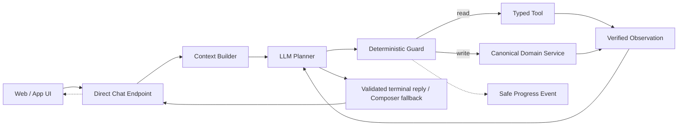
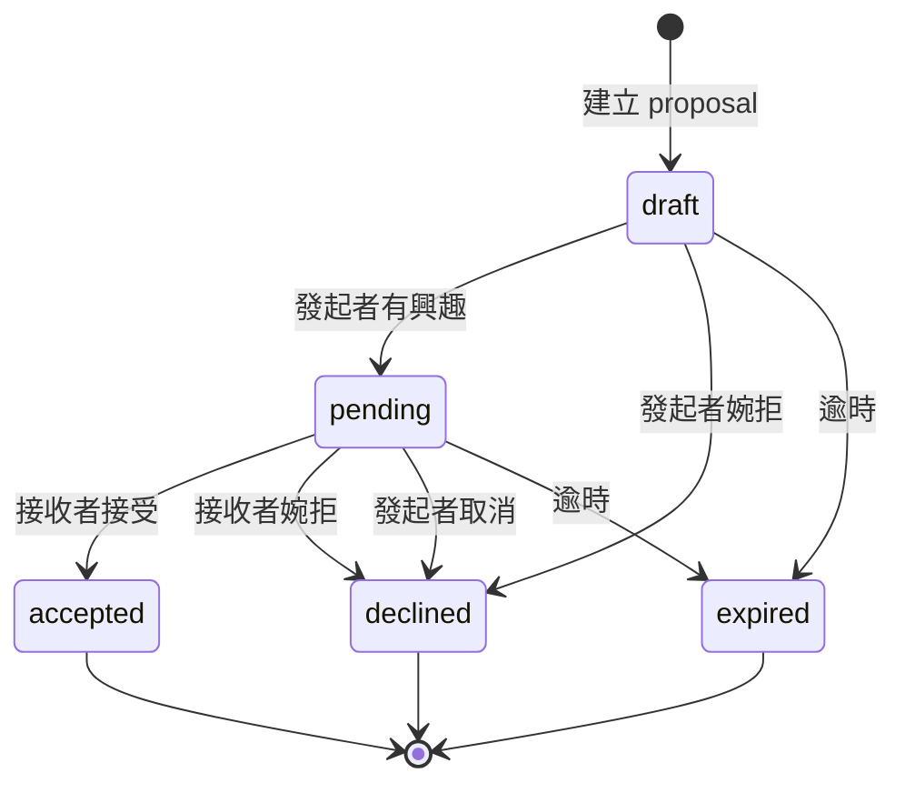
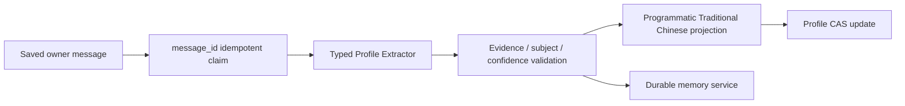

# 公開阿月 V2 架構與 App 遷移指南

本文件描述目前 `Dating-App` 的實際架構。程式碼是最終真相；任何改動若影響本文所述 contract，必須在同一個變更中更新本文。

## 1. 系統定位

公開阿月 V2 是一個 bounded、OpenClaw-style 的單一 agent loop：



它不是關鍵字 chatbot，也不是讓模型直接操作資料庫。公開阿月是本交友 App 內協助使用者認識人、牽線的 AI 媒人，不是另一位使用者，也不把目前 App 當成外部服務。LLM 負責語意規劃與自然回答；Runtime、Guard、typed tools 與 domain services 負責權限、狀態和副作用安全。

公開阿月與阿月悄悄話都是 sibling runtimes，不是 parent/subagent 關係。悄悄話 V2 使用獨立的 context、registry、trace 與隱私 namespace；公開阿月不能任意把 history 或 prompt 交給它。

## 2. Repository 結構與責任

| 路徑 | 責任 |
| --- | --- |
| `social_demotest/main.py` | FastAPI app、routers 與 index 初始化 |
| `social_demotest/frontend.html` | 現行 Web UI、NDJSON progress、match/calendar cards |
| `social_demotest/routers/chat.py` | Chat aggregate router；統一 `/api` prefix 與 `Chat` OpenAPI tag |
| `social_demotest/routers/chat_onboarding.py` | Big Five／deep profile onboarding HTTP adapters |
| `social_demotest/routers/chat_messages.py` | 聊天紀錄與聯絡人清單 HTTP adapters |
| `social_demotest/routers/relationship_dates.py` | 共同約會 domain service 的 thin HTTP adapters |
| `social_demotest/routers/demo.py` | Demo-only reset endpoint |
| `social_demotest/routers/proactive.py` | 主動關心／mediator polling 的 thin HTTP adapter |
| `social_demotest/routers/private_mediator.py` | 悄悄話 JSON／NDJSON HTTP adapters 與既有 private orchestration |
| `social_demotest/routers/relationship_quiz.py` | 已接受配對的默契小測驗 HTTP adapters |
| `social_demotest/routers/public_chat.py` | Public `/api/direct_chat*` adapters；V2 loop 與 explicit legacy rollback orchestration |
| `social_demotest/services/ayue_agent/runtime.py` | 公開 V2 唯一 orchestrator |
| `services/ayue_agent/context.py` | 每回合 privacy-safe context |
| `services/ayue_agent/contracts.py` | Provider-neutral Planner/Tool/Result contracts |
| `services/ayue_agent/router.py` | Planner adapter、tool policy、Guard、Composer |
| `services/ayue_agent/tool_registry.py` | ToolSpec、risk、schemas、progress、argument ownership |
| `services/ayue_agent/tools.py` | 唯讀 tool facade 與安全 projection |
| `services/ayue_agent/web_tools.py` | Tavily external-web adapter、URL safety 與 bounded projection |
| `services/ayue_agent/maps_client.py` | OpenStreetMap／Overpass 附近地點與距離 adapter、TTL cache |
| `services/ayue_agent/capabilities.py` | 對使用者一致的產品能力與用詞真相 |
| `services/ayue_agent/proactive_scheduler.py` | Server-side 主動關心排程、claim 與重試 |
| `services/relationship_engagement_service.py` | Probe、feedback、關係摘要與 post-chat engagement state |
| `services/proactive_delivery_service.py` | Polling 時 mediator event／care delivery 的 claim 與投遞流程 |
| `services/profile_task_service.py` | 已保存 owner 訊息的 profile extraction 排程 facade |
| `services/assessment_session_service.py` | 公開阿月聊天室內基本性格／深層探索的 owner-scoped、短期 session lifecycle |
| `services/mediator_context_service.py` | Legacy public／private mediator 共用的 bounded context projection |
| `services/relationship_quiz_service.py` | 默契小測驗 lifecycle、答案驗證與完成結果 projection |
| `services/ayue_agent/private_v2.py` | 悄悄話 V2 的獨立 context、registry 與 composer |
| `services/match_state_service.py` | Canonical match read model |
| `services/match_action_service.py` | Agent/API 共用的 match action facade 與 transition effects |
| `services/match_decision_service.py` | Atomic match CAS transition |
| `services/calendar_service.py` | 本人行事曆 CRUD 與存取控制 |
| `services/date_coordination_service.py` | 共同約會、改期、取消與雙方同步 |
| `services/profile_skills.py` | 非同步 owner-only profile extraction pipeline |
| `services/profile_contracts.py` | Typed recent-context／memory extraction contract |
| `services/memory_service.py` | Owner-scoped durable memory domain facade、outbox 與 Mongo read projection |
| `services/semantic_plan_service.py` | Accepted pair room 的 shared semantic plan；不是 Public owner memory |
| `matchmaker_agent/` | Port 9001 候選排序、Neo4j 記憶與 feedback service |
| `social_demotest/tests/` | Offline deterministic contract、trajectory、state、privacy tests |

## 3. Public chat request lifecycle

### JSON endpoint

`POST /api/direct_chat` 保持 V1 相容，request 使用 `DirectChatRequest`：

```json
{
  "user_id": "owner",
  "contact_id": "ai_assistant",
  "message": "他回覆了沒？",
  "chat_type": "direct",
  "mentioned_other_id": null,
  "mentioned_other_ids": []
}
```

V2 response 保留既有欄位，並可包含：

```json
{
  "reply": "有，對方已經接受了，聊天室也開啟了。",
  "is_locked": false,
  "conversation_intent": "match_status",
  "context_changed": false,
  "context_confirmation_needed": false,
  "agent_version": "v2",
  "agent_mode": "v2",
  "agent_run_id": "..."
}
```

### Streaming endpoint

公開阿月 UI 使用 `POST /api/direct_chat/stream`，request body 與 JSON endpoint 相同，response 為 `application/x-ndjson`：

```text
{"type":"run_started","agent_run_id":"..."}
{"type":"tool_started","agent_run_id":"...","step_id":"0:read","text":"我看一下目前的配對進度…"}
{"type":"tool_finished","agent_run_id":"...","step_id":"0:read","outcome":"ok"}
{"type":"final","response":{"reply":"...","agent_version":"v2","agent_run_id":"..."}}
```

公開事件絕不傳 tool arguments/result、prompt、ID、revision 或 raw exception。Web UI 在 progress 持續 250 ms 後才顯示單一暫時泡泡，新進度覆蓋該泡泡；final、error 或斷線時移除。

Streaming worker 擁有本次 run 的 background tasks。瀏覽器斷線只停止傳送事件，已開始的操作仍由 idempotency 保護並完成。Owner message 只保存一次，progress 不保存，final assistant reply 只保存一次。

## 4. 每回合 Context

`build_agent_turn_context_v2()` 每回合重新建立 `AgentTurnContextV2`：

- 本次 owner 原始訊息，清理後最多 1,600 字元。
- 最近 12 則對話，總長最多 6,000 字元。
- 本人近期情境。
- 本人手動保存的粗略所在地（城市／行政區）；不含地址或座標。
- 最多 8 筆本人相關記憶。
- 唯一可操作 proposal 的安全狀態與 server-side revision。
- 有效的 pending confirmation、calendar action draft、place-search draft 或 recent-context draft。
- 每回合建立一次的 Asia/Taipei authoritative clock 與相對日期解析。
- Public capability manifest。
- 本回合經 server 驗證的 @ 已接受聯絡人公開名稱；其內部 ID 僅保留 executor-side。超過三位時只告知 Planner 需要縮小範圍。

刻意排除：Mongo `_id`／document、`seed_user_*`、對方私人記憶、對方行事曆內容、無關舊媒合及完整原始 profile。

只有唯一 live proposal 時才進 context；若舊資料出現多筆 live proposal，fail closed，不讓模型任選一筆。舊 decline outcome 不會預載到每次聊天，避免一般「為什麼」被誤解成舊婉拒追問。

## 5. Planner、Guard 與 Loop

目前模型透過 JSON schema adapter 產生 `AgentDecision`；未來可換 native function calling，但 runtime contract 不變：

```text
kind: final | tool_call | confirmation
intent: chat | match_status | match_action | calendar | calendar_action |
        relationship | profile | assessment | memory | time | web | places | unclear
tool_name: registered tool or null
arguments: schema-valid, never IDs/revisions
confidence: 0..1
evidence_span: exact owner-message substring when required
```

Runtime 規則：

- 最多三個 planner/tool steps。
- 同回合相同工具與 normalized arguments 只執行一次；標記為可重用的 bounded read（目前為兩地直線距離）即使 Planner 改寫了等價地點字串，也會沿用第一個成功 observation，不重複執行。
- 每回合最多一次 write side effect；同一個已確認的 `calendar.cancel_my_events` 最多可取消 10 筆，仍視為一個使用者明確授權的 logical action。
- Match status、time、relationship 與 calendar update target 若缺 verified read，Guard 會先補 canonical read，而不是讓模型猜；Calendar write 的 schema-valid `tool_call` 會在 prerequisite read 完成後由 Runtime 升格為 confirmation，避免模型在「已讀取→確認」間跳針。單筆／批次取消則由 Runtime 以 owner-scoped lookup 直接建立 confirmation，避免為同一個取消要求多跑一次 Planner/read。當訊息明確同時指向本人與一位已確認聯絡人時，relationship 回答還需要本人與對方兩份公開摘要。
- Planner 無效、逾時、低信心、schema 不符或 tool output 不符 schema 時 fail closed。
- Planner 的 `final.reply` 在通過語言與安全驗證後可直接回覆，避免重複呼叫模型；空白或不安全輸出才由 Final Composer 使用「原始問題 + verified observations」生成。
- V2 error 不自動切回 legacy。

Pending confirmation 在 Planner 前處理。Match/calendar confirmation 預設 15 分鐘到期；calendar action draft 15 分鐘、recent-context draft 30 分鐘。Calendar draft 僅保存 bounded 的公開 action、arguments 與 missing fields，不能保存 event ID、revision 或原始資料；Runtime 在下一回合合併它，讓補日期、時間或行程描述不遺失既有目標。僅在存在 Calendar pending confirmation 時，精確的「對／是」也可視為確認；其他 pending surface 仍採既有封閉確認協議。狀態或 proposal revision 改變時，相關 confirmation 立即失效。

餐廳／景點推薦另使用 15 分鐘、owner-scoped 的 `agentic_place_search_draft`，只保存公開地點名稱、受限類別、半徑、結果上限與是否使用本人手動保存的粗略所在地。Planner 對一般「吃什麼」預設使用 `restaurant`；當使用者把選擇交給阿月或確認上一輪地點時，必須承接 draft 並讀取 `places.search_nearby`，不可再問已知地點或料理種類。Guard 在 draft 已足以搜尋時會強制先取得 typed places observation，成功後立即清除 draft；draft 逾時則由 Context Builder 清除。

多步 read 不由工具互相呼叫，而是由同一個 Planner 在每個 verified observation 回來後決定下一項缺少的資料；資料已足夠時必須收斂為 final。舉例來說，問「我和小玟會擦出什麼火花」會先安全確認小玟是已接受聯絡人、再讀取本人摘要；問兩地距離則只呼叫一次 `places.measure_distance`，因為它已封裝兩端地點解析。這些流程仍受三步 read 上限與既有隱私邊界保護。

聊天室內的基本性格與深層探索也遵循這個原則：Planner 只能提出
`profile.start_assessment`（以 `kind: basic|deep` 區分）的 confirmation；確認後，
Runtime 才建立 24 小時、owner-scoped 的 assessment session。session 進行中，後續答案
不再送入 Planner，而是只以本次 owner 訊息與 bounded typed draft 交給 analyzer；使用者可回覆「先不做了」、「退出測驗」或「結束測驗」離開。舊的
`big_five`／`deep_profile` 會保留到新一輪對應探索真正完成才原子替換；取消、逾時、provider
失敗或重送同一個 message ID 都不得覆寫它。session ID、暫存答案與 analyzer 原始輸出不能
出現在 Planner context、public event 或 trace。

## 6. Tool Registry

### 唯讀工具

| Tool | 回傳的產品真相 |
| --- | --- |
| `system.get_current_time` | 本回合固定時間、日期、星期與相對日期 |
| `calendar.list_my_events` | 本人已授權行程；預設未來 90 天或問題指定日期 |
| `calendar.find_my_event` | 本人一筆指定行程；可用已接受聯絡人的公開名稱縮小共同約會，且只能依該筆行程回答同行者 |
| `match.get_status` | Canonical search/proposal/terminal state 與聊天室狀態 |
| `match.get_counterparty_summary` | 唯一有效／已接受對象的公開名稱、近況、個性摘要、共同點與 chat state；只有 accepted 狀態可附本人手動保存的縣市／行政區粗略所在地 |
| `profile.get_recent_context` | 本人已保存的 current context 與 revision |
| `profile.get_self_summary` | 本人的已完成興趣、基礎／深層性格資料、偏好、近期情境與粗略地區；只在使用者主動詢問本人資料時讀取 |
| `memory.search_my_profile` | 本人記憶摘要、近期情境及最多 8 筆偏好 |
| `relationship.get_verified_evidence` | 已接受關係中可驗證的共同互動摘要 |
| `relationship.get_mentioned_contact_summary` | 本回合 @ 的已接受聯絡人公開近況、初始想認識的事、個性摘要、粗略所在地與可驗證共同點；只有有有效 @ 時可見，未填地區時不得猜測 |
| `relationship.list_accepted_contacts` | 最多 8 位已接受聯絡人的公開摘要與粗略所在地；可安全確認文字提及的已接受對象，並用於判斷活動／地點或雙方特質適合度，不代表可得知對方行程或已答應邀約 |
| `web.search` | Tavily 最新公開搜尋結果；只有設定 `TAVILY_API_KEY` 時可見 |
| `web.extract` | 本回合搜尋結果或 owner 明確提供公開網址的有限內容；拒絕內網與非 HTTP(S) URL |
| `places.search_nearby` | 以本人手動保存的粗略所在地或使用者指定地點，查詢附近餐廳／景點等公開地點 |
| `places.measure_distance` | 一次解析並計算兩個公開地點的直線距離；不保存精確住址或即時定位，同回合成功結果可重用 |
| `places.resolve_place` | 將原句或本回合已確認的店家名稱解析為公開地點；預設使用 OSM，Google Places 啟用時優先使用 Google，失敗則回退 OSM |

### 寫入工具

| Tool | Confirmation | 寫入 owner |
| --- | --- | --- |
| `match.start_search` | 必須 | `match_action_service.start_match_search` |
| `match.decide_active_proposal` | 只在唯一可決定 proposal 可見；由 revision Guard 保護 | `match_action_service.decide_active_proposal` |
| `calendar.create_my_event` | 必須 | Calendar service |
| `calendar.update_my_event` | 必須 | Calendar/date coordination service |
| `calendar.cancel_my_event` | 必須 | Calendar/date coordination service |
| `calendar.cancel_my_events` | 必須；指定 2–10 筆或最多 10 筆未來行程 | Calendar/date coordination service |
| `profile.start_assessment`（`kind=basic`） | 必須 | `assessment_session_service`（完成前保留既有 Big Five） |
| `profile.start_assessment`（`kind=deep`） | 必須 | `assessment_session_service`（完成前保留既有深層資料） |

Planner 只提供自然任務參數，例如行程標題、日期、公開顯示名稱、時間或 interested/declined。`user_id`、proposal/event ID、已接受聯絡人的內部 ID、expected status 與 revision 全由 executor 根據登入者及 canonical state 取得；公開名稱只可作為 server-side accepted-contact lookup 的輸入，不能自行授權任何關係資料。

取消 confirmation 使用 v3 pending payload：單筆仍保留舊欄位相容性，批次則只在 server side 保存 `targets[]`（event ID、revision、source type、共同約會關係資料與安全顯示標籤）。使用者回覆「確認」時不再呼叫 Planner；Runtime 先逐筆 preflight 所有 target 的 owner、active status 與 revision，任一筆已變動就整批不刪除。通過後每筆各有 confirmation-indexed idempotency key；意外單筆失敗會回報成功／失敗筆數，不會假稱全數完成。`calendar_action` 的 final 只可用於帶有 missing fields 的澄清，禁止用一般文字假裝已建立 confirmation。

`calendar.find_my_event` 對公開名稱採精確正規化比對，而且只搜尋 canonical accepted contacts。公開名稱只對應一位已接受聯絡人時，才可用活動／日期搜尋共同約會；若有同名聯絡人，必須在讀取行事曆內容前 fail closed，回傳 typed ambiguity reason 讓 Planner 追問可區分的公開資訊。找不到名稱與找不到行程也是不同 reason code，不能一律套用「哪一天」的罐頭追問。結果最多回傳三筆安全候選。

`profile.get_self_summary` 只投影 owner 已完成的 profile 欄位。Graph memory 最多輸出 8 筆正規化後的偏好 label 與 stance，不回傳 key、owner ID、evidence、confidence 或儲存 metadata；缺少的測驗區段以 `missing_sections` 表示，Planner 不得把未完成資料說成既定結論。

`@` 是 entity binding 而不是自動查資料的開關：使用者真正詢問對方近況、特質或比較時，Planner 才會讀取公開摘要；普通提及與打招呼不讀。前端以文字內、不可拆分的 mention token 顯示，Enter 選取候選或送出、Shift+Enter 換行；訊息紀錄只保存已驗證的公開顯示名稱以重建 token。送出可保留 `@名稱` 文字與 optional `mentions_inline=true`，但伺服器仍重新驗證所有 client IDs 是否為已接受聯絡人，且最多允許三位。

地點卡是 places observation 的 provider-neutral presentation layer：Runtime 只能從 typed place tools 產生最多三張卡，不能從一般 web snippet 猜店家；多候選時只投影 final reply 明確點名的安全地點，整回合只有一個 verified place 時可作唯一結果 fallback。Web／Places verified observation 可使用較完整的 5 句／約 240 字呈現額度，一般聊天仍維持 2 句／約 80 字。OSM 卡片保存經過長度與 URL 驗證的店名、分類、地址摘要、距離文字、地圖與 attribution，前端以 lazy OSM embed 或分類封面呈現。Google Places 是可選升級；只有經驗證的 Place ID 才能 lazy-load UI Kit Compact，載入失敗時仍保留自製卡。兩種 provider 都不保存照片、評分或評論。

## 6.1 Proactive Care

主動關心由 `services/ayue_agent/proactive_scheduler.py` 的 server-side scheduler 產生與保存；不依賴瀏覽器輪詢。`GET /api/proactive_check` 只在使用者在線且不忙碌時，取回一次已保存的 delivery marker。它使用 `services/ayue_agent/proactive_care.py` 的 typed contract，而非 legacy persona prompt：

- context 僅含最近 owner 訊息、前一則阿月回覆、本人近期情境、使用者口吻與 Asia/Taipei 時段；不含 Big Five、配對、對方或行事曆；
- output 必須有 `message`、`focus`、`grounding_span`、`confidence`；角色反轉、無法驗證原文、低信心、壞 JSON 或 provider failure 一律不發送；
- atomic activity claim 確保同一次使用者活動即使多分頁 polling 也最多保存一則；event metadata 只保留 `proactive_care`、run ID 與 grounding source code。
- 頻率設定與每次本人公開阿月訊息都保存 `next_proactive_care_at`；provider 或格式失敗採 1、5、15 分鐘最多三次退避，無 grounding 則安全略過、不發罐頭訊息。

## 6.2 Private mediator V2

`POST /api/mediator/private` 保留 JSON 相容；`POST /api/mediator/private/stream` 在 `AYUE_PRIVATE_AGENTIC_MODE=on` 時提供 `run_started`、`tool_started`、`tool_finished`、`final`、`error` NDJSON 事件。

- Private context 分開保存本人 profile、對方 shareable projection、planner-only advisory、共同聊天室最近 12 則，以及本人自己的悄悄話最近 12 則。
- 對方與阿月的私人悄悄話永不進 context；對方 advisory 只能產生 `warm/playful/calm/direct` 的抽象策略，Final Composer 看不到原始 advisory。
- 目前 typed tools 為 pair summary、shared history、busy/free availability、request fun fact、start date coordination。後兩者都需要 pair-scoped 15 分鐘 confirmation。
- Private trace 不保存雙方 ID、profile、history、arguments 或 observations；V2 失敗不得落回 legacy private router。
- 配對成立後的 GIF 是 server-owned durable event，不是 private agent tool。Giphy 啟用時，系統會隨機挑選 `funny` 類安全搜尋詞，並在有限的 process-local recent URL window 內避開重複；同一次配對對兩人的私訊也各自挑選不同 GIF。沒有 API key、外部失敗或可用媒體不足時 fail-soft，不影響配對成立。

## 7. Match lifecycle 與一致性



`draft/pending` 是 live proposal；`accepted/declined/expired` 是歷史／終態。Accepted contact 不應被當成仍在等待的 proposal，也不應讓歷史卡片重新可操作。

每筆新 proposal 使用 `reason_version: "v4_friend_intro"`，並在 `friend_intro_v4` 保存兩個內部角色綁定投影：`initiator_preview` 與 `receiver_invitation`。每個投影只可由綁定的 viewer 讀取，並固定保存建立當下對方的公開近期情境與公開性格；其中的 `viewer_id`／`counterparty_id` 只作 server-side 驗證，絕不放進卡片、通知或 agent context。建立新提案時，兩個方向各自使用一次單向、角色已綁定的 LLM 文案器；不得用一個雙向 JSON 讓模型自行對應角色。接收方邀請必須介紹發起人的近期情境、帶入雙方公開性格，以「可能／或許／可以」等假設語氣描述互動，最後詢問是否想認識或參與。驗證失敗、逾時、補造事實或壞 JSON 時，改用同樣完整且不截斷詢問句的 deterministic friend-introduction fallback。`services/match_reason_service.py` 是唯一 viewer projection owner；提案卡、mediator delivery、agent 公開關係摘要與 `/api/notifications` 均只讀它的 `reason_for_viewer`。Queue 只保存控制資訊，delivery 會從 canonical match 重建唯一 viewer payload；接收方送達資料不可攜帶 participant ID、理由項目、分數、對方 profile 片段或發起方預覽。舊 V3 live proposal 只可從 immutable create-time snapshot 讀取安全 fallback，不能被遷移、重算或覆寫。

所有卡片與自然語言決策共用同一條寫入路徑：

```text
UI /api/match/decision ─┐
                        ├→ match_action_service → match_decision_service → Mongo CAS
Agent write tool ───────┘                                      │
                                                               └→ committed effects
```

CAS query 同時綁定 participant、expected status 與 expected revision。成功後 revision 加一並追加 `state_history`。Idempotency key 重送回同一結果；stale request 回最新 status/revision，不覆寫已提交終態。

Matchmaker flow 與公開阿月 loop 分離：Mongo vector search 先縮小候選集合，port 9001 matchmaker 再利用 profile、Neo4j 記憶及規則排序。這不是隨機配對；沒有符合 qualification 的人選時可回報沒有結果。

### Durable match-search jobs

使用者確認找人後，runtime 只建立一筆 owner-scoped `match_search_jobs` 工作，不會在聊天 request thread 內跑候選搜尋。Job 以 `queued → running → completed | no_candidates | failed | cancelled | stale` 表示生命週期；worker 以 atomic claim、lease 與 `active_user_id` unique index 確保同一使用者同時最多一筆 active job。每次工作保留建立時的近期情境 revision，並在載入 profile、vector search、graph check 與 proposal 寫入前重新確認 ownership、revision 與 live match；失效工作不可建立第二張 proposal。Proposal 另以內部 `search_job_id` 綁定來源 job，worker lease 接手或服務重啟時恢復同一 proposal，不重新插入。

`GET /api/match/status` 僅回傳安全的 status、step、progress percent、1–3 分鐘估計和不含識別碼的 proposal 摘要。聊天室在搜尋期間顯示置中、與一般訊息外觀分離的暫時流程卡，包含「阿月牽線流程／配對中」、目前階段、四步驟進度條與背景執行提示；它不建立 message。完成、取消、失敗、連續 status 錯誤或離開公開阿月時立即移除。proposal 操作所需的 identifier 仍只由既有 mediator card 事件提供。

## 8. Calendar 與共同約會

- Public Ayue 可以讀取、建立、修改、取消本人的行程。
- Calendar read 只在使用者已授權時成功。
- 所有 Calendar writes 都需要確認；自然語言事件提示會以標題、活動、地點與日期別名雙向比對，若仍有多筆候選則 fail closed 請使用者縮小範圍。
- 私人行程直接修改本人資料。
- 共同約會取消時同步雙方並通知對方；改期會建立需對方重新確認的協調狀態。通知與卡片同步屬於 post-commit effect，失敗不得把已提交的取消／改期回報成可重試的寫入失敗。
- 「直接替我向對方約會／代替雙方答應」目前不是 Public Ayue 的能力，不能誤轉成私人日曆新增。
- 對方行事曆細節不能進 prompt 或回覆；跨使用者 availability 僅可使用產品允許的安全 projection。

## 9. Profile Pipeline

Profile extraction 是聊天完成後的 owner-scoped 非同步流程，不是 Agent observations 的副產品：



Extractor 的新 facts／evidence 只來自該筆已保存 owner message。為了支援使用者分句描述同一件事，它可以另外收到一個 30 分鐘內有效、只含已驗證 typed values 的 active episode；不含舊原句、assistant reply、evidence ID、工具或配對資料。`ProfileExtractionDecision` 可提出：

- `recent_context.action: update | clear | none`
- `recent_context.episode_relation: continue | new | unrelated`
- Typed fields：`activity`、`destination`、`timing`、`companion_intent`
- Durable memory：typed key、繁中 label、stance、category、confidence、evidence span

每個新欄位的 evidence span 必須是本次 owner message 的連續子字串且 subject 必須是 owner。只有 `episode_relation=continue` 且 episode ID 仍相同、未逾時時 reducer 才合併欄位；`new` 會建立新 episode，`unrelated` 不寫入。Match operation、等待回覆、assistant text、tool result、match state 與第三方特徵不得寫入近期情境。時間不是近期情境的必要條件。摘要由程式組合，不把模型自由文字直接存入 `current_context`。

同一 message ID 由 unique claim 保證只處理一次；current-context write 使用 revision CAS，避免較舊的非同步工作覆蓋較新訊息。

Public V2 回覆可另外帶 `profile_update_pending` 與 opaque `profile_process_run_key`。前端收到後顯示獨立的暫時泡泡「我整理一下你剛提到的近況…」，並以 run key 輪詢 privacy-safe process projection；它與 agent tool progress 使用不同狀態，不會互相覆蓋。`updated`、`no_update`、`error`、`timeout`、較新工作取代或切換聯絡人時都移除泡泡。process 狀態與泡泡不保存 owner 原句、extractor result、內部 ID，也不寫入 `messages` 或新增 assistant reply。永久的「近期情境已更新」通知已移除；需要使用者操作的 context confirmation 仍保留。

### 9.2 Assessment sessions

基本性格與深層探索由 `services/assessment_session_service.py` 唯一管理；Public V2 的 `profile.start_assessment`（`kind=basic|deep`）及既有 `/api/chat` onboarding UI 都只呼叫這個 domain service，不直接寫 `big_five`、`deep_profile` 或另一套 temporary state。兩份 versioned skill 分別位於 `skills/basic-profile-assessment/` 與 `skills/deep-profile-assessment/`。

每位使用者同時最多一個未結束 session。session 為 owner-scoped，保存 session ID、owner ID、kind、`active | awaiting_commit | completed | cancelled | expired`、revision、turn count、bounded typed draft 與 24 小時 expiry；不保存 raw prompt、assistant history、tool result 或其他人的資料。所有回答、取消、到期與 commit 都以 session revision CAS 保護，message ID 用於重送去重。

開始測驗與套用完成草稿都是兩次不同確認：開始 confirmation 只建立 draft session；模型宣告完成時，正式 profile 仍不變、session 轉為 `awaiting_commit`。使用者明確確認後，service 才在同一個原子更新中替換該 kind 的正式 profile 並標示 `completed`；取消或過期清除 draft、保留先前完成資料。Runtime 在一般 Planner 前接管 active／awaiting-commit session，assessment owner messages 不進近期情境或 durable memory extractor。公開 JSON 與 stream final 可附帶安全 metadata：`assessment_state`、`assessment_kind`、`assessment_revision`，不含 session ID 或 draft。

### 9.1 Durable memory、relationship graph 與 Context Engine

- 本人 durable preference 的 source of truth 是 Neo4j owner-scoped `HAS_PREFERENCE`；Mongo `profile_memory_preview` 只是 bounded read projection。
- 雙人聊天室的 `semantic_plans` 與 room-scoped KG triples 是 relationship state，不等於任一方的本人長期偏好。
- 系統生成的長期建議是 recommendation，不是 owner fact；不得寫入 Graph preference 或增加 evidence count。
- `context.py` 目前仍是 Public V2 唯一 Context Builder。未來若抽出 Context Engine，必須輸出 versioned typed bundle，再由 Public／Private adapter 套用各自 privacy policy；不可直接回傳 prompt 或 raw Graph。

詳細資料模型、建議 contract、整合點與測試要求見 [`MEMORY_CONTEXT_ENGINE_GUIDE.md`](./MEMORY_CONTEXT_ENGINE_GUIDE.md)。

## 10. Trace 與資料安全

V2 agent trace 保存於 `agent_runs`，tool idempotency 保存於 `agent_tool_calls`。Trace 只允許：

- context/capability version
- visible tool names
- planner kind/tool/confidence
- Guard result codes
- tool name/ok/error code
- event sequence、cache hits、composer outcome
- public progress delivery code、latency、final intent/fallback code

Trace 不保存完整 prompt、owner message、observations、tool arguments/results、對方資料或 raw exception。新增欄位時必須先加入 allowlist 並補 privacy test。

## 11. Runtime flags

Public V2 在程式中的預設值仍是 `off`，部署／App 測試必須明確設定：

| Flag | 用途 |
| --- | --- |
| `AYUE_AGENT_V2_MODE=on|off` | Public V2 或人工 legacy rollback |
| `AYUE_AGENT_V2_USER_ALLOWLIST` | 漸進式指定使用者；空值代表全部適用 mode |
| `AYUE_AGENT_MAX_STEPS` | Read loop 上限，程式硬限制最大 3 |
| `AYUE_DEFAULT_TIMEZONE` | 預設 `Asia/Taipei` |
| `AYUE_PROFILE_SKILLS_MODE=on|dry_run|off` | Profile extractor 寫入、觀察或停用 |
| `AYUE_PROFILE_SKILLS_USER_ALLOWLIST` | Profile rollout allowlist |
| `AYUE_PRIVATE_AGENTIC_MODE` | Private runtime，與 Public V2 分開 |
| `AYUE_PRIVATE_AGENTIC_USER_ALLOWLIST` | Private V2 rollout allowlist |
| `AYUE_MAPS_ENABLED` | 是否提供 OpenStreetMap／Overpass 地點工具 |
| `AYUE_MAPS_MONGO_CACHE` | 是否將地點工具 cache 寫入 Mongo；預設 `off` |
| `AYUE_GOOGLE_PLACE_CARDS_ENABLED` | 啟用 Google Places UI Kit 卡片；需同時設定下列兩把 key |
| `GOOGLE_PLACES_SERVER_API_KEY` | 後端 Places API New key；僅限 Places API |
| `GOOGLE_MAPS_BROWSER_API_KEY` | 前端 Maps JavaScript / Places UI Kit key；必須限制 HTTP referrer |

基礎服務另需 `MONGO_URI`、LLM/Ollama、Google embedding；設定 `TAVILY_API_KEY` 後才開啟 Web Search／Extract，選填 `TAVILY_PROJECT`。地點工具使用 Nominatim 與 Overpass 的公開 HTTP API，可用 `OSM_*` 變數替換 endpoint 與 user agent。port 9001 matchmaker 需要 `LLM_*` 與 Neo4j 設定。可提交的欄位範例見 `social_demotest/.env.example` 與 `matchmaker_agent/.env.example`；包含真實密鑰的 `.env` 不得提交或交付。

## 12. App 從 V1 遷移到 V2

### Backend contract

1. 先部署本版本 backend 與 Mongo indexes，保留既有 `/api/direct_chat` JSON endpoint。
2. 在測試使用者 allowlist 設定 `AYUE_AGENT_V2_MODE=on`；確認後再擴大範圍。
3. 不可在 App 自己重建 intent classification。App 只送原始訊息與必要 mention，語意由 V2 Planner 處理。
4. 不可在 V2 timeout/error 時由 App 再呼叫 V1 endpoint；這會造成訊息及副作用重複。

### Public Ayue chat UI

1. 只有 `contact_id == "ai_assistant"` 改用 `/api/direct_chat/stream`。
2. 逐行解析 NDJSON，忽略未知 event；不要假設一個 network chunk 就是一個完整 JSON event。
3. `tool_started.text` 顯示為單一暫時狀態；不要顯示技術 tool name。
4. `tool_finished` 只更新狀態，不新增永久訊息。
5. `final.response` 按原本 JSON response 處理並顯示正式回答。
6. `error`、斷線或沒有 final 時清除暫時泡泡，提示安全重試；不要自動重送可能含副作用的 request。
7. 防止同一使用者在 public run 尚未結束前重複送出。

### Match cards

1. 顯示 API 回傳的 `stage` 與 `proposal_revision`，不要只看舊 `status` 文案推測按鈕。
2. 接受／婉拒／取消呼叫 `POST /api/match/decision`：

```json
{
  "user_id": "owner",
  "match_id": "server-provided-id",
  "action": "accept",
  "expected_status": "draft",
  "expected_revision": 0,
  "explicit_reasons": []
}
```

3. HTTP 409 代表 stale state；App 重新讀 `/api/match/status` 或 `/api/match/state` 後更新卡片，不重送舊 decision。
4. Accepted match 轉為 contact/chat；歷史 proposal card 保留但不可操作。

### Profile 與 Calendar

- App 不直接產生或提交 `current_context` 摘要；只送 owner 原始聊天訊息，profile pipeline 非同步更新。
- UI 顯示 profile 更新時應讀 server projection，不把 assistant reply 當 evidence。
- 所在地透過 `PATCH /api/profile/location` 手動更新，只保存城市與行政區；第一版只用於顯示與附近公開資訊查詢，不進 matchmaker 排序。
- Calendar CRUD 與共同約會沿用 server revision/state；不要在 client 端只修改畫面。

### Rollback

緊急 rollback 只由部署環境把 `AYUE_AGENT_V2_MODE` 設為 `off` 並重啟服務。Rollback 是人工操作，不是 request-level fallback；App 不需要也不應知道 Planner 是否失敗。

## 13. 驗收基線

每次改動至少驗證：

- 一般聊天自然回答，不因沒有工具而拒答。
- 配對結果、目前日期、本人行事曆與近期情境都經正確 read tool。
- 地點推薦在搜尋條件已足夠時先讀取 places tool；「隨意推薦」不得重複追問料理類型。
- 明確找人先 confirmation，確認後只搜尋一次。
- Planner duplicate、壞 JSON、timeout、低信心不造成重複工具或 legacy fallback。
- Proposal stale revision、重複 request、雙方並發不覆寫終態。
- Profile evidence 可追溯、只來自 owner message，且摘要為繁體中文。
- Stream progress 不進聊天紀錄，事件不洩漏 arguments/results/ID。
- JSON direct chat、其他聯絡人及 private chat 不因 Public V2 改動而破壞。
- Test harness 不連正式 Atlas/Neo4j；完整 deterministic tests、Python compile、兩個服務健康檢查通過。

目前的 trajectory fixtures 位於：

- `social_demotest/tests/fixtures/ayue_public_trajectories.json`
- `social_demotest/tests/fixtures/ayue_refactor_trajectory_catalog.json`

新增真實失敗案例時，優先將它匿名化後加入 trajectory，再修對應 contract、projection 或 prompt；不要先增加一句特例 regex。
