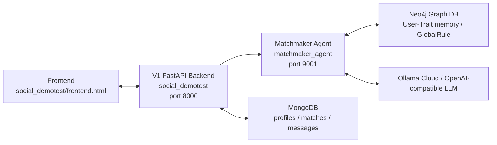
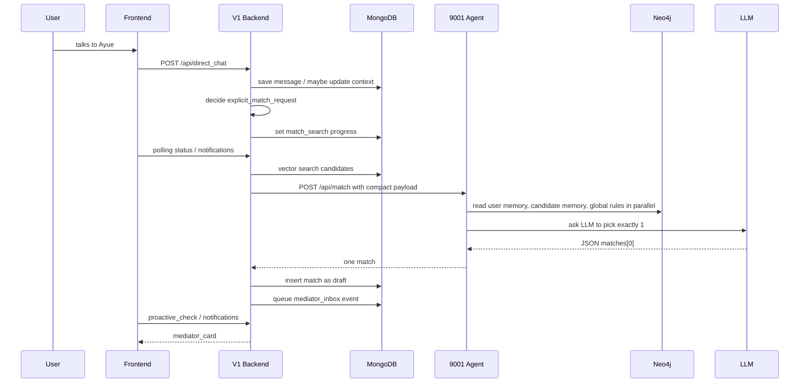
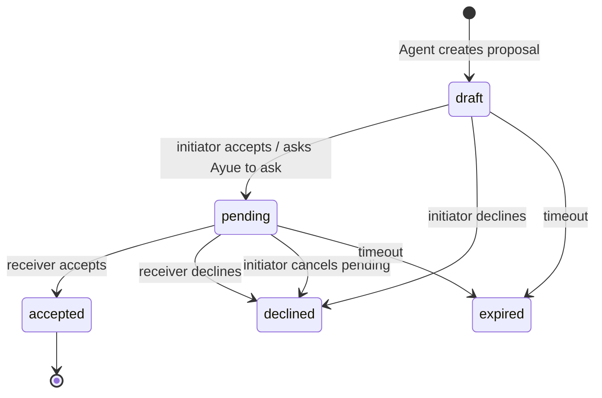
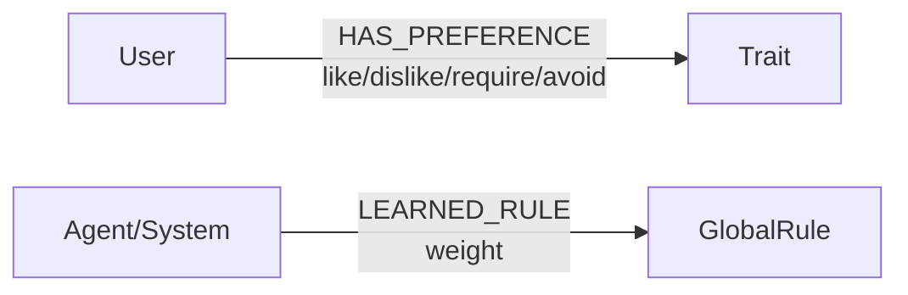

# Current Ayue Matchmaker Handoff

This document describes the current implementation in this branch after the latest Ayue / Matchmaker Agent integration work. It is meant for the next teammate or coding agent that needs to continue development without accidentally undoing the current product decisions.

## 1. High-Level Architecture

The system is split into three main parts:



V1 owns the product state, UI-facing APIs, MongoDB collections, vector search, match lifecycle, chat flow, and frontend events.

The 9001 Matchmaker Agent owns graph-memory reading, global rule reading, final LLM-based candidate selection, recommendation wording, dynamic decline tags, and graph feedback learning.

## 2. Key Files

| Area | File | Responsibility |
| --- | --- | --- |
| Frontend | `social_demotest/frontend.html` | Single-page UI, chat, match cards, accept/decline buttons, progress display |
| Direct chat / Ayue | `social_demotest/routers/chat.py` | Main Ayue conversation flow, context updates, intent detection, match triggering, active match blocking |
| Matching V1 | `social_demotest/routers/match.py` | Candidate retrieval, compact agent payload, match state machine, accept/decline/cancel |
| V1 config | `social_demotest/config.py` | Ollama model config and fast chat model fallback |
| Agent API | `matchmaker_agent/agent_api.py` | `/api/match`, `/api/feedback`, `/api/global_reflection`, Neo4j reads/writes |
| Agent prompt | `matchmaker_agent/matchmaker.py` | System prompt and LLM output contract |

## 3. Current Product Decision: Always Recommend One

Important: do not reintroduce deterministic scoring gates.

The current desired behavior is:

- V1 gives the Agent a small candidate set.
- The Agent must choose exactly one best candidate.
- Even if the fit is imperfect, the Agent should still recommend the relatively best person.
- The reason should be honest when the match is not activity-perfect.
- We should not block recommendations with self-designed thresholds such as `MIN_TRUSTED_MATCH_SCORE`.
- We should not invent a hand-written score formula to decide "no match".

The Agent prompt currently asks for one match only. V1 also only persists one match from the Agent response.

## 4. Current Matching Flow



## 5. Candidate Retrieval and Payload Compaction

V1 still does MongoDB vector search first. The Agent does not scan the whole database.

Current candidate limit:

- Env: `MATCH_AGENT_CANDIDATE_LIMIT`
- Default: `3`
- Clamp: `1` to `5`

Before sending candidates to the Agent, V1 compacts each profile through `strip_agent_payload()` in `social_demotest/routers/match.py`.

The compact payload keeps only:

- `user_id`
- `initial_interest`
- `current_context`
- `profile_memory_summary`
- `context_signals`
- Big Five scores and short summary
- Deep profile summary, values, life goals, relationship needs, stress coping, ideal future

The compact payload removes heavy or noisy fields:

- `context_embedding`
- timestamps
- match state
- UI state
- large metadata
- unrelated profile fields

This was added because sending full profile documents made the prompt huge and caused model context errors or slow calls.

## 6. Agent Input / Output Contract

The 9001 Agent receives:

- `target_user`
- `candidates`
- target deep profile
- target graph memory from Neo4j
- candidate graph memory from Neo4j
- compact global rules from Neo4j

The Agent should return JSON:

```json
{
  "matches": [
    {
      "matched_user_id": "seed_user_xx",
      "recommendation_reason": "給發起者看的牽線理由",
      "receiver_reason": "給被邀請者看的牽線理由",
      "distinctive_tags": ["短標籤1", "短標籤2", "短標籤3", "短標籤4"],
      "score_breakdown": {
        "context": 0,
        "graph": 0,
        "values": 0,
        "personality": 0,
        "conversation": 0,
        "total": 0
      },
      "top_reasons": ["理由1", "理由2"]
    }
  ]
}
```

Even though `score_breakdown` still exists for explanation/debug, V1 should not use it as a hard gate. It is not the product decision maker.

## 7. Match State Machine

Current states:



Meaning:

- `draft`: only the initiator has a card and must decide.
- `pending`: initiator has asked the other side; both sides should not open another line casually.
- `accepted`: chatroom is opened.
- `declined`: this line is closed.
- `expired`: stale line is closed.

Current behavior:

- A `draft` can be automatically replaced when the user clearly asks for a new match.
- A `pending` match blocks new matching because the other person has already been asked.
- Pending initiator can cancel through decline/cancel wording.

## 8. Ayue Direct Chat Behavior

`social_demotest/routers/chat.py` is the main flow for talking to Ayue.

Current direction:

- Ayue should feel like a proactive matchmaker, not a passive chatbot.
- Users usually come to Ayue because they may want people; do not repeatedly ask "do you want to find someone?".
- If the user gives activity + timing + social intent, Ayue should move toward matching naturally.
- If the user gives vague context, Ayue can ask one useful follow-up.
- Appearance requests should be converted into supportable vibes or style, not fake physical claims.
- Example: "找帥的" can become "乾淨、有自信、外向、成熟感".

Important bug fixes already applied:

- "幫我配對新人" should trigger a new match request, not get answered as an accepted-contact relationship query.
- Card accept/decline intent is handled before generic active-match helper logic.
- Old active-match pre-intercept that kept recalling stale cards during new-context updates has been removed.
- A draft owned by the current user should not permanently block the user from asking for a new direction; it can be replaced.
- A pending line should block duplicate matching unless cancelled or resolved.

## 9. Frontend Match Card Flow

The frontend receives match cards through two paths:

- `direct_chat` response includes `mediator_card`
- polling `/api/proactive_check` or `/api/notifications` claims queued `mediator_inbox` events

When `mediator_card` exists, `frontend.html` appends the card immediately.

Progress text currently shows friendly intermediate steps, for example:

- `先鎖定方向`
- `開始翻名單`
- `整理近期需求`
- `找可能合拍的人`
- `查圖譜地雷`
- `寫牽線理由`

This is only a UX mask; the heavy work is still the Agent LLM call.

## 10. Graph Memory

Neo4j currently stores two main concepts:



User memory:

- Likes/dislikes extracted from conversation and decline feedback.
- Dynamic decline tags are sent to `/api/match/decline`, then forwarded to 9001 `/api/feedback`.
- 9001 writes traits such as `LIKES_TRAIT` and `DISLIKES_TRAIT`.

Global rules:

- Written after successful accepted matches through `/api/global_reflection`.
- Current prompt asks for short rules, ideally 10-20 Chinese characters and max 30.
- Agent reads only compact top rules for matching.

## 11. Global Rule Weighting

Current design:

- If a new successful-match rule is semantically similar to an existing GlobalRule, increment the existing relationship weight.
- If not similar, create a new GlobalRule with initial `weight = 1`.
- This avoids creating endless near-duplicate long rules.

Relevant code in `matchmaker_agent/agent_api.py`:

- `compact_global_rule`
- `normalize_rule_text`
- `rule_ngrams`
- `rule_similarity`
- `find_similar_global_rule`
- `/api/global_reflection`

Relevant env:

- `MATCH_GLOBAL_RULE_LIMIT`, default `2`
- `MATCH_GLOBAL_RULE_CHAR_LIMIT`, default `30`
- `GLOBAL_RULE_SIMILARITY_THRESHOLD`, default `0.38`

## 12. Performance Notes

The main bottleneck is the LLM call in the 9001 Agent.

Observed pattern:

- Neo4j parallel reads: usually about `0.7s` to `1.1s`
- Agent payload after compaction: often about `1500` to `3000` chars, depending on memory size
- LLM call: can range from `10s` to `30s+`

Models tested informally:

- `gemini-3-flash-preview:cloud`: strong and fast, but availability/expiry concern.
- `deepseek-v4-flash:cloud`: decent fallback, often around 14-22s but can vary.
- `glm-5.2:cloud`: good quality, speed varies.
- `kimi-k2.6:cloud`: too slow in tests.
- `qwen3.5:cloud`: slow and sometimes lower reliability for strict JSON/behavior.

Optimization already done:

- Removed `context_embedding` from Agent payload.
- Reduced candidate count to 3 by default.
- Parallelized Neo4j reads.
- Shortened global rules.
- Shortened Agent prompt and output length.

Remaining performance lever:

- Use the fastest reliable model.
- Keep candidate payload compact.
- Keep global rules short.
- Avoid adding another LLM summarization step unless absolutely necessary, because it can make total latency worse.

## 13. Current Known Sharp Edges

These are not necessarily bugs, but future agents should know them:

- The frontend still polls instead of using WebSocket/server push.
- `score_breakdown` exists but should not become a hard decision gate.
- Some legacy code/comments may contain mojibake, but the current runtime strings around the main flow have been cleaned.
- Active-match blocking is subtle: draft and pending must be treated differently.
- Accepted matches should not prevent users from asking for new matches.
- Pending matches should usually prevent opening another simultaneous line.
- Some helper functions still use lightweight keyword heuristics for cancellation or social activity detection. Do not expand these into a rigid scoring algorithm without product discussion.

## 14. Do Not Break

Please be careful with these areas:

- Do not reintroduce "no match" based on a hand-written score threshold.
- Do not make the user manually trigger every match with exact phrases only.
- Do not let a stale draft card override a newer user context.
- Do not let accepted contacts block "配對新人".
- Do not bypass `/api/match/decline` feedback forwarding to 9001.
- Do not remove distinctive tags from match cards; they are used for graph feedback.
- Do not send full Mongo profile documents to the Agent.

## 15. How to Run

Typical local run:

1. Start the 9001 Agent:

```powershell
cd D:\Sunny\專案\Project\matchmaker_agent
.\agent_env\Scripts\python.exe agent_api.py
```

2. Start the V1 backend:

```powershell
cd D:\Sunny\專案\Project\social_demotest
python main.py
```

3. Open:

```text
http://127.0.0.1:8000/
```

## 16. Useful Debug Logs

During matching, watch for:

```text
[TIMING][V1 /api/match]
[TIMING][9001 /api/match]
[TIMING][MatchmakerAgent.match]
Agent matched ids:
```

Healthy shape:

- V1 loading and vector search should be sub-second to low single-digit seconds.
- 9001 Neo4j reads should be around one second.
- Most remaining time is LLM call.

If no card appears:

- Check `matches` collection for a `draft`.
- Check `profiles.active_match_proposal_id`.
- Check `profiles.mediator_inbox`.
- Check whether a stale `matchmaking_request_id` or `context_revision` guard skipped the event.

If accept/decline does nothing:

- Check frontend console.
- Check `/api/match/accept` or `/api/match/decline`.
- Check whether the card is stale.
- Check if match status is already `pending`, `accepted`, or `declined`.

## 17. Current Integration Checklist

Before making large changes, verify:

- Direct chat still responds normally.
- A clear social request creates one draft match card.
- Declining a card shows/stores feedback.
- Accepting a card sends a pending invitation to the receiver.
- Receiver can accept and open a chatroom.
- Accepted contacts do not block future new matching.
- Pending lines block duplicate matching until resolved or cancelled.
- Agent receives compact payload, not full profile documents.
- Agent returns exactly one match.

