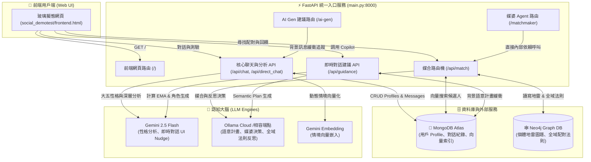

# 🚀 統一智慧社交媒合平台 (Unified AI Social Platform)

歡迎來到 **Unified AI Social Platform**！這是一個基於 **FastAPI** 統一架構建立的次世代智慧社交平台。本專案無縫整合了**核心社交平台、大五性格與深層價值觀分析、圖譜感知 A/B 對比媒合（雙黃蛋推薦機制），以及即時對話腳手架（AI Copilot）**三大智慧服務，透過整合式入口對外提供高品質的社交體驗。

---

## 📖 平台導覽與核心機制

本專案將以下三套高複雜度的獨立微服務融為一體，以單一埠（Port 8000）統一運行，彼此協同運作：

### 1. 核心社交平台 (`social_demotest`) — 門戶與資料基石
*   **前端入口 (`/`)**：提供極具質感的**玻璃擬態（Glassmorphism）**響應式網頁，介面生動活潑，具備精美微動畫與即時對話視窗。
*   **基礎性格分析 (`big_five`)**：引導新註冊用戶進行多輪 AI 聊天面試，自動分析並計算其**大五性格特質（Big Five Personality）**與總結，存入 MongoDB。
*   **深層價值觀剖析 (`deep_profile`)**：探索比大五人格更深層的依附類型（Attachment Style）、決策風格（Decision Style）以及核心價值觀（Core Values），作為高權重媒合依據。
*   **情境聊天室與虛擬分身**：支持與其他匹配用戶進行模擬聊天。後端會讀取對方的個性設定，使用 LLM **精準扮演對方的性格特質**進行交談，宛如真實互動。
*   **AI 主動關懷 (`proactive_check`)**：定時檢查用戶的上一次動態情境（例如：「想去福岡玩」），由 AI 小助手主動發起關心對話，提升用戶黏著度。

### 2. 認知媒婆 Agent (`matchmaker_agent`) — 圖譜感知 A/B 對比推薦
*   **向量預篩選**：結合 MongoDB Atlas 的 **Vector Search**，根據用戶當前的「近期情境與動態」從資料庫中初步篩選出最相似的候選人。
*   **雙黃蛋對比媒合（Contrastive A/B Matching）**：媒婆 Agent 接收預選名單後，會為用戶挑選出**兩位**在「情境」上高度契合，但在「性格風格」上**形成有趣反差**的對象（例如：熱血行動派 vs. 溫柔傾聽型），讓用戶在 A/B 盲測中探索最適合當下心境的陪伴。
*   **個體圖譜地雷防禦 (`DISLIKES_TRAIT`)**：結合 **Neo4j 圖資料庫**，當發起者或接收者婉拒某個配對時，用戶可勾選對方的反感特質，Agent 會透過反思提取出地雷特質，在 Neo4j 中建立 `(User)-[:HAS_PREFERENCE {type: "DISLIKES_TRAIT"}]->(Trait)` 關係。在未來的配對中，一旦候選人具備該地雷特質，將被**一票否決**。
*   **全域配對法則自我歸納 (`Global Heuristics`)**：當一對用戶互相接受配對（狀態變為 `accepted`）時，系統自動啟動後台反思任務，將兩人的性格與情境交由 LLM 提煉為一條**抽象化的配對金律**（例如：「情緒低谷的用戶，適合搭配低神經質且高同理心的傾聽者」），並寫入 Neo4j 全域法則節點。這些通用法則會隨著系統運作越來越聰明，並回饋給未來的配對決策。

### 3. AI 聊天建議助手 (`NEW_AI_GEN`) — 即時對話腳手架（AI Copilot）
*   **對話健康度指標追蹤**：即時監控對話紀錄，計算訊息回覆延遲（Latency EMA）與訊息字數對等度（Parity EMA）。
*   **四階段角色扮演切換 (Conversational Scaffolding)**：根據對話指標，自動在背景調整 Copilot 輔助強度與策略：
    *   `FRIEND`（友伴階段）：提供輕鬆好聊的共同破冰話題。
    *   `FACILITATOR`（促進者階段）：給予輕度引導，維持當前熱門話題。
    *   `ADVISER`（建議者階段）：當對話出現瓶頸或不對等時，提供具體策略與切入點。
    *   `MENTOR`（導師階段）：當檢測到零按鍵盲目調用（mashing）或互動不健康時，改以**蘇格拉底式提問**引導用戶自我思考「你想達到什麼社交目的」，不直接提供答案。
*   **反抄襲與漸褪機制 (Anti-Plagiarism & Fade-Out)**：**絕對禁止直接給出 Word-for-Word 的完整對話句子**，亦不准使用引號，僅提示溝通方向，強迫用戶展現真實自我，避免對 AI 產生依賴。
*   **知識圖譜三元組動態提取**：自動從聊天記錄中動態提取實體與關係（如 `subject --[predicate]--> object`），Predicate 限制於標準語意列表中，用於後續知識深化。

---

## 🛠️ 系統架構圖



---

## 📂 專案目錄結構

```text
Project/
├── main.py                     # 🚀 頂層統一 FastAPI 入口與路由掛載點
├── requirements.txt            # 📦 專案依賴套件清單
├── .env                        # 🔑 統一環境變數設定檔（金鑰管理中心）
├── social_demotest/            # 🏠 核心社交與分析模組
│   ├── main.py                 # (原) 獨立運作入口
│   ├── config.py               # 載入頂層 .env 設定
│   ├── database.py             # MongoDB 連線初始化
│   ├── models.py               # Pydantic 資料傳輸模型 (DTO)
│   ├── frontend.html           # 🎨 Premium 玻璃擬態前端網頁
│   ├── routers/                # 路由層 (chat, match, guidance, system, frontend)
│   └── services/               # 服務層 (ai, chat, graph, guidance, idle, provenance)
├── matchmaker_agent/           # 💘 媒婆 Agent 認知模組
│   ├── agent_api.py            # 媒合路由與 Neo4j 整合邏輯
│   └── matchmaker.py           # 媒婆 Agent 人設、A/B 推薦與反思提示詞
├── NEW_AI_GEN/                 # 🤖 即時對話建議與腳手架模組
│   ├── app.py                  # 聊天日誌追蹤、健康度計算與 Scaffold UI Nudge 生成
│   └── (其他輔助說明文件)
└── venv/                       # 🐍 Python 虛擬環境
```

---

## 🔑 環境變數配置 (.env)

本專案使用統一的 `.env` 檔案管理所有敏感金鑰與服務配置，請放置於**專案根目錄**下。格式與預設如下：

```env
# --- MongoDB 連線設定 ---
MONGO_URI="您的 MongoDB Atlas 連線字串 (包含使用者與密碼)"
AI_CHAT_MONGO_URI="您的 MongoDB Atlas 連線字串 (專供 AI 建議緩衝與 Semantic Plan 使用)"

# --- Neo4j 圖資料庫設定 ---
NEO4J_URI="neo4j+s://xxxx.databases.neo4j.io"
NEO4J_USERNAME="neo4j"
NEO4J_PASSWORD="您的密碼"
NEO4J_DATABASE="neo4j"

# --- Google AI Studio (Embedding 向量嵌入) ---
GOOGLE_AI_STUDIO_API_KEY="您的 Gemini API 金鑰"
GOOGLE_EMBEDDING_MODEL="models/gemini-embedding-2"

# --- Google Genai (AI Copilot 建議生成) ---
GEMINI_API_KEY="您的 Gemini API 金鑰"

# --- Ollama / OpenAI 相容雲端模型 (媒合決策與全域反思) ---
LLM_API_KEY="您的 API 金鑰"
LLM_BASE_URL="https://ollama.com/v1"
LLM_MODEL_ID="gemini-3-flash-preview:cloud"

# --- AI Gen 專用模型 (NEW_AI_GEN 語意計畫生成) ---
AI_GEN_MODEL_ID="gemma4:31b-cloud"

# --- Server 伺服器啟動設定 ---
SERVER_HOST="127.0.0.1"
SERVER_PORT=8000
```

---

## ⚙️ 快速安裝與啟動步驟

### 步驟 1：複製並配置環境
請在專案根目錄下確認 `.env` 檔案已正確配置，並填入有效的 API 金鑰與資料庫連線資訊。

### 步驟 2：建立並啟動虛擬環境 (Linux/macOS)
```bash
# 建立虛擬環境
python3 -m venv venv

# 啟用虛擬環境
source venv/bin/activate
```

### 步驟 3：安裝依賴套件
```bash
pip install --upgrade pip
pip install -r requirements.txt
```

### 步驟 4：啟動統一服務
直接運行專案根目錄下的 `main.py`：
```bash
python main.py
```
啟動成功後，控制台會顯示如下輸出：
```text
🚀 啟動統一服務：http://127.0.0.1:8000
   📱 前端頁面:       http://localhost:8000/
   🔌 主系統 API:     http://localhost:8000/api/
   💘 媒婆 Agent:     http://localhost:8000/matchmaker/
   🤖 AI Gen:         http://localhost:8000/ai-gen/
   ❤️  健康檢查:      http://localhost:8000/health
```

---

## 🎯 測試與操作指南（完整使用故事）

為了讓您能完美體驗這套高階智慧系統，請按照以下步驟體驗完整的社交故事：

### 第一階段：帳號初始化與 mock 資料生成
1.  開啟瀏覽器導航至：`http://localhost:8000/`。
2.  預設登入身分為 `demo_user`。此時會彈出「**註冊興趣**」視窗，這是模擬註冊流程，請填入您當前的心境或興趣（例如：「今天工作壓力好大，想去咖啡廳喝杯拿鐵聊聊天」），然後點擊 **開始測驗**。
3.  為了體驗豐富的配對，請下滑至左下角，點選「**生成十筆資料**」。這會在 MongoDB 中建立 10 位具備隨機大五性格、深層價值觀、以及近期動態情境的虛擬種子用戶 (`seed_user_01` 至 `seed_user_10`)，並自動計算他們的動態情境向量。

### 第二階段：大五人格 & 深層價值觀測驗
1.  **大五性格訪談**：AI 媒人會順著您填寫的註冊興趣（如：喝拿鐵）主動拋出情境題。請隨性回答 3 輪對話。AI 將動態分析您的大五特質，並在右側面板展示即時更新的性格 JSON。
2.  **解鎖 Messenger 介面**：完成大五分析後，AI 媒人會說「你的性格分析已經完成囉！」，此時會自動解鎖並切換至 Messenger 聊天室畫面。
3.  **深層價值觀測驗 (解鎖雙黃蛋核心)**：在左側聯絡人清單上方，點擊「🎯 **深層分析**」，開啟進階測驗。AI 將詢問關於您的人生哲學、依附傾向、決策風格等問題。回答完成後，右側將解鎖高度專業的深層價值觀分析 JSON。

### 第三階段：向量預篩選與「雙黃蛋」A/B 對比配對
1.  在聊天室介面，對著「AI 小助手」發送您的**最新近期情境**（例如：「剛下班，突然好想去居酒屋喝一杯吃串燒」）。AI 小助手會透過多輪對話引導，隨後鎖定情境，將其存為您的最新動態，並生成嵌入向量。
2.  點擊左上角的「🌟 **尋找配對**」。
3.  **後台運作機制**：
    *   系統首先使用 MongoDB Atlas Vector Search 進行向量相似度檢索，快速找出情境最相似的 5 位候選人。
    *   將這 5 位候選人連同您的性格、深層價值觀、以及 Neo4j 圖譜中的個體記憶與全域法則，通通交給 **V2 媒婆 Agent**。
    *   媒婆 Agent 進行深度思考，挑選出 **兩位 (Card A & Card B) 風格形成強烈互補/反差** 的完美對象。
4.  **A/B 卡片確認**：此時網頁會彈出「🥚 **雙黃蛋配對結果**」視窗，為您呈現 Card A 與 Card B。您可以看見媒婆針對「發起者（您）」寫下的幽默推薦信，以及針對「接收者（對方）」設計的真誠告白。下方亦有開發者 Debug 驗證表格。

### 第四階段：狀態機流轉與圖譜記憶（地雷 vs. 全域法則）
*   **情境 1：您選擇接受邀請**
    *   點擊卡片上的「**發送邀請**」，此時該配對狀態從 `draft` 變為 `pending`。
    *   為了模擬對方也接受，您可以透過右上角頭像下拉選單切換至對應的種子用戶（例如 `seed_user_02`），您會看見「🔔 **新的配對邀請**」通知。
    *   點擊「**同意聊天**」，狀態變為 `accepted`。
    *   **觸發連鎖效應**：
        1.  **AI 自動破冰**：系統在後台為發起者與接受者生成一封符合雙方性格的**破冰第一封訊息**。
        2.  **全域法則歸納**：後台自動啟動 `do_global_reflection`，從這次成功的案例中萃取出通用的配對經驗，並以 `LEARNED_RULE` 關係存入 **Neo4j**（如信心度加 1）。
*   **情境 2：您選擇婉拒邀請（個體地雷防禦）**
    *   若您點擊「**婉拒**」，系統會貼心地彈出問卷：「能偷偷告訴我們，是哪個部分讓您猶豫了嗎？」。
    *   畫面上會呈現媒婆從該候選人檔案中動態提煉出的**專屬標籤**（如：掌控欲較強、不愛社交、實力至上主義）。
    *   勾選您不喜歡的特質並確認後，配對狀態變為 `declined`。
    *   **觸發個體地雷反思**：後台觸發 `do_feedback`，媒婆 Agent 將您的拒絕原因反思為 2-4 字的精煉特質名詞，並寫入 **Neo4j** 作為您的 `DISLIKES_TRAIT` 地雷。下一次配對時，只要候選人具備此特質，媒婆將直接拒絕推薦！

### 第五階段：對話建議助手 (AI Copilot) 與健康度監控
1.  與匹配成功的種子用戶開啟聊天。
2.  由於種子用戶是 AI 模擬扮演，您可以像真人一樣與他們對話。
3.  在輸入框左側點選「🤖 **Copilot**」按鈕，即可呼叫 **AI 聊天助手**。
4.  助手會根據當前對話的 Latency/Parity EMA 動態判定當前溝通角色 (`FRIEND` / `FACILITATOR` / `ADVISER` / `MENTOR`)，並在對話框上方生成 UI Nudge 建議。
5.  點擊 `[+] View AI Reasoning` 還能透視 AI 做出此建議的完整邏輯思維與審計日誌！

---

祝您在 **Unified AI Social Platform** 的智慧社交旅程中探索愉快！如有任何系統設計、資料庫優化或算法問題，歡迎隨時深入討論。
