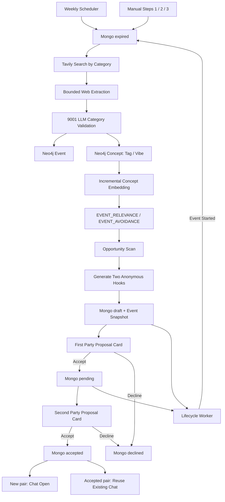
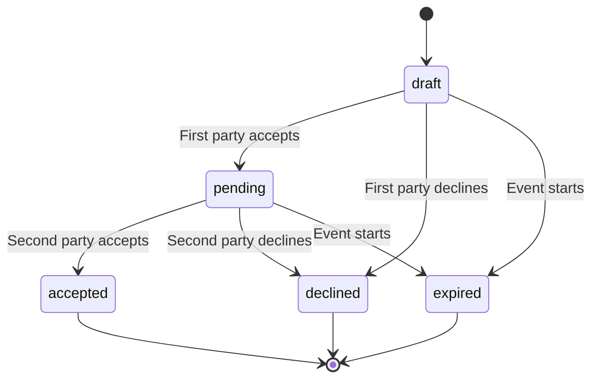

# Event-Driven Proactive Matchmaker Guide

本文件是「事件驅動主動媒人」功能的完整技術與操作指南。閱讀者不需要先理解
`matchmaker_new`；正式實作已整合在 `social_demotest` 與
`matchmaker_agent`。

## 1. 功能目標

傳統流程是使用者先要求配對，系統才搜尋人選。本功能改為：

1. 系統定期探索未來公開活動。
2. 將活動整理成可查詢的 Neo4j `Event` 與 `Concept`。
3. 使用 Graph 找到「同一活動可能同時適合兩位使用者」的機會。
4. 阿月主動提出活動牽線，但不預設任何一方同意。
5. 雙方依序同意；尚未認識的 pair 才建立聊天室，已 accepted 的同一 pair 則沿用既有聊天室。

活動是媒人提出邀請的共同話題與見面契機，不是取代原本的人格、偏好、地雷與
配對狀態機。

## 2. 目前實作範圍

試行地區為高雄，預設探索未來 30 天。目前 pilot 支援五類活動：

| 類別 | Discovery Skill | 主要保留內容 |
| --- | --- | --- |
| 市集 | `event-market-discovery` | 文創市集、生活市集及明確含市集的活動 |
| 音樂 | `event-music-discovery` | 演唱會、音樂節、現場演出及音樂會 |
| 運動 | `event-sports-discovery` | 賽事、路跑、戶外體驗及可參與運動活動 |
| 節慶 | `event-festival-discovery` | 文化祭、嘉年華、燈會及期間限定節慶 |
| 美食 | `event-food-discovery` | 美食節、品飲、食品展及期間限定餐飲活動 |

每份 skill 都位於 `skills/event-*-discovery/SKILL.md`，包含該類別的搜尋策略、
必要證據與排除條件。Skill 是受信任的本機規則，不會自行上網或寫資料庫。

## 3. 系統邊界

| 元件 | Owner | 責任 |
| --- | --- | --- |
| `social_demotest` port 8000 | Product backend | 排程、Tavily 搜尋、網頁抽取、embedding、Mongo proposal、API 與 UI |
| `matchmaker_agent` port 9001 | Graph/Matchmaker service | LLM 活動驗證、Neo4j 寫入、Graph traversal、主動邀請文案 |
| Neo4j Aura | Graph projection | Event、Concept、使用者到活動的可重建關聯 |
| MongoDB | Workflow source of truth | proposal namespace、`draft/pending/accepted/declined/expired`、pair cooldown 與 Event snapshot |
| Frontend | Presentation | 匿名提案、活動資訊、接受／婉拒操作與狀態 hydration |

重要原則：

- Web Search 只由 port 8000 執行。
- Neo4j 不保存雙方同意狀態。
- MongoDB 不保存 Event 搜尋原文。
- LLM 不可決定 user ID、Event ID、match ID 或 proposal revision。
- 正式配對 decision 仍走既有 CAS/idempotency domain service。

## 4. 完整資料流



### 4.1 完整案例：阿月用市集替兩個人牽線

以下人物與資料皆為示意。假設今天是 `2026/08/05`，系統要找高雄未來 30 天的活動：

1. **搜尋活動**：市集類別先查可信來源，例如
   `高雄 2026年8月 2026年9月 site:twmarket.tw 市集 活動日期`，再用
   `高雄 2026年8月 2026年9月 文創市集 假日市集 生活節 ACCUPASS 官方` 補漏；
   精確的 30 天範圍由後端驗證。Window 永遠從每次執行當下的 Asia/Taipei 時間往後延伸，
   不是抓同一個曆月；每週一執行時自然得到「當週一至未來 30 天」，不需要限定每月 1 日執行。
2. **驗證來源**：系統找到「下一站，少女心市」，頁面明確寫出活動日期、地點與主辦資訊，
   因此通過 LLM schema 驗證及程式日期、地區、URL 檢查。LLM 還必須回傳逐字取自來源摘要的
   `date_evidence`；程式確認 evidence 是來源子字串，並檢查每個場次的開始日與結束日都出現在
   evidence 中。日期缺漏、改寫或不一致時直接拒絕，避免將「8/1～8/2」誤抽成「8/1～8/9」。
   `date_evidence` 只用於 ingest validation，不寫入 Graph 或公開卡片。
3. **寫入 Graph**：Neo4j 建立或更新一個 Event，並連到
   tags `[文創市集, 插畫, 生活選物]` 與 vibes `[可愛, 輕鬆, 熱鬧]`。
4. **建立語意關係**：小安近期說「週末想逛可愛的市集」，小晴長期喜歡插畫與生活選物。
   Concept embedding 分別讓兩人建立到同一 Event 的 `EVENT_RELEVANCE`。
5. **套用地雷**：另一位使用者若明確表示「不參加擁擠市集」，而 activity dislike 與 Event tag
   的相似度超過硬地雷門檻，會建立 `EVENT_AVOIDANCE`，不會進入本次候選。
6. **排除不可邀請者**：已有 live `event_invitation` 的人會進 exclusion list；一般
   `relationship_match` 不阻擋活動邀請。同一輪剛收到活動 proposal 的人也會加入，避免一輪內同時收到多張活動邀請。
7. **找到 Graph bridge**：Graph 確認小安與小晴都連到該 Event、沒有活動地雷，也沒有雙方人物地雷衝突。
8. **決定先問誰**：系統先詢問關聯證據較弱的一方，因為她若願意，證據較強的一方通常更值得接著詢問；
   這只決定順序，不代表替任何一方答應。
9. **產生匿名 Hook**：阿月分別為兩人生成 2 至 3 句邀請，說明「為什麼是這個活動」與
   「為什麼可能適合認識這個人」，但第一方看不到第二方身份。
10. **建立 Mongo proposal**：保存 `status=draft`、`proposal_revision=0` 及 Event snapshot，第一方看到卡片。
11. **雙方同意**：第一方依 CAS 從 `draft/revision 0` 接受後成為 `pending/revision 1`；第二方再依 CAS
    從 `pending/revision 1` 接受後成為 `accepted/revision 2`。尚未建立關係的 pair 此時開聊天室；
    已 accepted 的同一 pair 只保存本次活動邀請結果並沿用既有聊天室，不建立第二個 relationship anchor。
12. **活動過期**：如果活動先開始而雙方尚未完成同意，lifecycle 將 live proposal 改為 `expired`；
    已接受聊天室仍保留 Mongo 中的 Event snapshot，不受 Neo4j TTL 清理影響。

資料責任可以簡化成一句話：Neo4j 負責「找關聯」，MongoDB 負責「保存提案與雙方決定」，
LLM 負責「驗證活動與寫自然邀請」，前端只呈現 canonical state。

## 5. Phase A：活動搜尋

### 5.1 觸發方式

正式入口：

```http
POST /api/match/events/discover
```

API 只會把工作寫入 MongoDB 的 singleton queue，不會在 port 8000 request 內執行長時間搜尋。
獨立的 `social_demotest/event_worker.py` 會領取工作、定期續租並執行搜尋；worker 中斷後，租約到期的
工作可由下一個 worker 安全接手。

Worker 是常駐的 background consumer，但不會每 2 秒查詢 MongoDB。正式喚醒路徑是
MongoDB Change Stream：singleton job 進入 `queued` 後立即通知 worker。Worker 啟動時仍會先 claim
既有 queued 或租約過期的 running job；Change Stream 中斷或漏失通知時，才依
`EVENT_WORKER_RECONCILE_SECONDS`（預設 60 秒）做低頻 reconciliation，之後重新建立 stream。
因此 API、worker 或模型短暫重啟都不會遺失已排入的工作。

Event 與 Public Ayue 可以並行，Event queue 不會接管或解析聊天訊息。曾觀察到的 Public Ayue
generic error 是 Planner provider 回傳非字串 optional 欄位，使舊 normalization 發生 `TypeError`；
該欄位現在會交給 strict schema validation 與 bounded retry，與 Event Worker 並行本身無關。

從 `social_demotest` 啟動 worker：

```powershell
..\.project-venv\Scripts\python.exe event_worker.py
```

預設 scheduler 為 `off`，避免尚未人工驗證來源品質時自動寫入：

```dotenv
EVENT_WEEKLY_CYCLE_ENABLED=off
```

`on` 時由獨立 Event Worker 在每週一依序執行：限定範圍清理 Event 庫存、搜尋並建圖、
等待 Concept embedding/relevance 投影完成，最後掃描並產生活動邀請。若 relevance 在有界時間內未完成，
cycle 回報 `partial` 並跳過邀請，不會用不完整 Graph 強行配對。手動 Demo 仍保留三個獨立按鈕，不會因單獨執行 discovery
而自動清理或發送邀請。

### 5.2 搜尋額度

每個類別有兩條搜尋方向：

1. 官方、政府、場館或主辦來源優先查詢。
2. 一般補漏查詢。

高雄 pilot 在泛用搜尋前另有 `REGION_CURATED_SOURCES` 類別來源表。展覽會先讀高美館／高雄會展網，
市集讀 twmarket 高雄分類，音樂讀高雄演出列表，運動讀公開賽事列表，節慶讀高雄旅遊網與市府活動頁，
美食讀主辦單位的食品展／酒展頁與市府活動頁。這些只是較穩定的候選入口，不是跳過驗證的白名單；頁面內容仍須
通過相同 LLM schema 與 deterministic checks。新增其他縣市時應新增自己的區域來源設定，不能沿用高雄網址。

以市集為例，搜尋 query 使用涵蓋視窗的月份詞，不把精確起訖區間塞給搜尋引擎：

```text
高雄 2026年8月 2026年9月 site:twmarket.tw OR site:kcginfo.kcg.gov.tw
OR site:khh.travel OR site:kpmc.com.tw OR site:pier2.org 市集 活動日期
高雄 2026年8月 2026年9月 文創市集 假日市集 生活節 ACCUPASS 官方
```

精確日期範圍留給後端 deterministic validation。第一條刻意限制可信網站，優先取得較可靠的日期、場地與主辦資訊；第二條加入售票／活動平台並保留較廣召回，
用來找到官方站尚未收錄的主辦頁、售票頁或活動整理頁。兩者找到的內容都只是「不可信候選」，
仍必須通過 LLM typed schema 與程式的日期、地區、類別、必要欄位及 URL 安全驗證。

限制如下：

- 每條 query 最多收 5 筆 metadata 候選。
- 每類最多保留 10 筆 metadata，再依 curated／可信平台／一般來源排序，最多深讀 10 筆；頁面仍以每次 2 個 URL 有界限抽取。
- 五類總共最多深讀 30 筆；展覽暫不進入 pilot 排程。
- 高雄每類可先放入 1 至 2 個 curated feeds，但仍受每類上限限制。
- URL 在同一類別內去重；同一官方行事曆可被不同類別各自驗證，避免共用入口只餵到第一類。

metadata 階段會先排除標題或摘要只出現過去年份的明顯舊頁；「已結束」等自然語言不直接硬刪，
避免誤傷仍在進行的長期活動。候選 URL 會先做安全檢查，Tavily 已成功抽取的頁面視為可讀；
其餘頁面用 HEAD 檢查，遇到 403／405 才以 bounded streaming GET 補驗。失效網址不送入 LLM。

這些只是待驗證候選，不代表 20 筆都會成為 Event。

### 5.2.1 Adaptive supplemental search

第一輪驗證後，系統先讀取 Neo4j 的 active Event inventory；每類預設搜尋目標與硬上限為 6 個，
最低合格庫存為 4 個。
某類總供給不足，或有效活動全擠在未來 30 天的同一段時間時，系統才執行額外補查。
時間分布分成近期（0 至 7 天）、中段（8 至 20 天）與後段（21 天以上）：

- `outside_window` 較多時，query 強調精確日期範圍與即將舉辦。
- `missing_or_invalid_date` 較多時，query 強調完整日期、起訖時間與場地。
- `model_returned_empty` 時，query 強調公開活動、官方／主辦頁、報名資訊。
- 其他不足情況使用該類別的 recovery terms，例如運動的報名／賽程、音樂的售票／演出時間。
- 若數量已足但某時段為空，第三條 query 會加入「本週／本月中旬／本月下旬」等空窗提示。

補查最多使用三條不同方向的 recovery query，每條最多收 5 筆，合計最多 8 個新 URL、抽取 8 頁，
並排除第一輪已看過的 URL。同類別來源會分成 bounded LLM batch；音樂為降低 timeout 每批最多 3 個，其他類別每批最多 6 個，並在 Graph 中該類
active Event 達到 6 筆後停止後續抽取與補搜。
每輪最多補 6 類，優先處理數量缺口最大、時間空窗較多的類別；補查 ingest 最多等待 180 秒。
已達目標的類別不補查；第一輪 ingest timeout 的類別仍可用新的較小來源批次進入補搜，但不會重送完全相同的失敗 request。回傳的 `supplemental` 會列出觸發類別、額外候選數與真正增加的 Event 數；
`coverage` 會同時列出尚未達最低 4 筆的 `deficits` 與尚未達目標 6 筆的
`target_deficits`。若 9001 inventory 暫時不可用，
才退回本輪 batch 計數並清楚標記 `source=current_batch`。

「最低 4、目標 6」是 coverage SLO，不是放寬真實性檢查。某類若只找到 3 個可驗證活動，系統回傳
`coverage.status=underfilled` 與精確缺額，供下一輪更換來源或人工檢查；禁止為湊滿 4 個寫入日期不明、
已過期或其實不屬於該類的活動。

### 5.3 網頁抽取

- 每類最多抽取 10 個頁面，讓列表入口與活動詳情頁都有機會進入驗證。
- 五類總共最多 30 個頁面；這是每週背景建庫額度，不在使用者互動 request 內執行。
- 一次最多送 2 個 URL 給 Tavily Extract；抽取完成後，來源依正規化標題聚類，再以有界限批次送入 LLM 驗證。
- LLM 回傳後先以 Unicode NFKC、大小寫、空白及標點正規化標題與場地；來源 URL 只作證據，不參與活動 identity。
- 同一活動的場地與場次合併到 `venues`、`sessions`，追蹤 query 不會產生重複 Event。
- 每類使用自己的 extraction focus，例如音樂要求演出日期與場地，運動要求比賽／體驗日期與運動項目。
- 每頁內容截斷後才送入驗證，不保存 raw HTML 或完整頁面。
- 成功抽取會使用內容雜湊快取；頁面內容、skill 或 schema 改變，或對應 Event 已不在 active Graph 時會自動失效。空結果不快取。

如果 Web Search 或 Extract 部分逾時，整輪回傳 `partial`，其他類別仍繼續處理。

每個 category ingest 對 timeout、連線錯誤、HTTP 5xx 與無效 JSON 預設最多嘗試兩次；Event 使用
deterministic `MERGE` identity，因此回應遺失後重送不會建立第二份相同 Event。4xx（408／429 除外）
不重試，避免把 contract 或權限錯誤當成暫時故障。最終 `error_codes` 會保留 bounded 原因，例如
`ingest_timeout`、`ingest_http_503` 或 `ingest_invalid_json`，不再全部壓成 `ingest_unavailable`。

## 6. Phase B：LLM 活動驗證

Port 8000 將每個類別分開送至：

```http
POST http://127.0.0.1:9001/api/events/ingest
```

驗證模型由 port 9001 的 `EVENT_EXTRACTION_MODEL_ID` 控制，與一般配對模型分開。

### 6.1 必要欄位

Event 只有符合以下條件才會寫入。日期採區間重疊判斷：活動開始日不得晚於收錄截止日，
且活動結束日不得早於現在；因此已開展但尚未結束的展覽可以收錄，已結束活動仍會被拒絕：

若來源同時提供多日活動的完整起訖與細場次，系統優先保留仍有效的細場次；若細場次全已過期，
才回頭驗證完整活動區間。這可避免多日展會在第一天結束後被誤刪，又不會放行整體已過期的活動。

- 地點明確在指定地區。
- `starts_at` 位於現在到 `window_days` 內。
- 有明確 title。
- 有明確 venue。
- 有明確日期。
- 有輸入中出現過且通過安全檢查的 `source_url`。
- 符合 server 指定 `discovery_category` 的 skill 規則。

LLM 可以淘汰不合格資料，但不能把 server 指定的「運動」改成「美食」。寫入時
一律採用來源批次的 `discovery_category`。

### 6.2 日期規則

- 來源有日期與時間：`time_precision=datetime`。
- 來源只有日期：開始設為當日 `00:00:00`、結束設為 `23:59:59`，並標記 `time_precision=date`。
- UI 在 `date` 模式只顯示日期，不假裝知道活動時間。
- 日期不明時直接淘汰，不使用推測日期。

### 6.3 去重與探索加速

`Event.dedupe_key` 使用：

```text
NFKC normalized title + NFKC normalized venue + Asia/Taipei calendar date
```

- **脫鉤 Category**：`dedupe_key` 故意不包含 `category`，確保同一個實體活動（例如「2026 高雄雄嗨調酒節」）無論從「市集」、「節慶」還是「美食」被抓到，都生成 100% 相同的唯一 key，在 Neo4j `MERGE` 時原地更新，絕不重複建立節點。
- **標題與地標語意合併**：
  - 自動清除標題噪訊（年份 2026、場次（第3場）、8/21、中括號與直線分隔符）。
  - 支援關鍵地標語意比對（衛武營、愛河河西路、駁二、凹子底、大東公園等）。
  - 當標題互為長度大於等於 4 的子字串且同場地時，自動識別為同一活動合併多場次 sessions。
- **探索加速與過濾**：
  - **跨類別 URL 全局去重**：同一個大型入口網或新聞 PDF 在同一輪探索中只抓取一次，避免不同類別重複下載與重複呼叫 LLM 抽取。
  - **ThreadPool 並行檢查**：候選網址存活性檢查全面採用多執行緒並行驗證（耗時從數分鐘縮短為 3~5 秒）。
  - **Fast Pre-filter**：本地端過濾 404 與過短垃圾網頁，避免浪費模型配額。
  - **五大類別數量平衡**：透過語意智能微調（如調酒/咖啡歸為美食、客家傳統/嘉年華歸為節慶），使五大類別均勻達到 4~6 筆的庫存目標。

同一活動從不同來源再次發現時更新既有 Event；同一列表頁包含多個不同活動時，
可以建立多個 Event。活動 identity 使用類別、NFKC 正規化標題、正規化場地與日期；同日活動只有在標題完全一致，或標題高度相似且場地一致／高度相似時才合併，不包含任何活動名稱特例。不同日期或不同場地仍保留。非市集若同名、同場地、同類別且日期相鄰不超過兩天，
會保守合併成一個多場次 Event；市集只接受來源明確列為同一活動的
`sessions`，不把不同日期的兩筆市集自動視為同一場。

例如官方頁與售票頁都找到同一天的「港灣音樂祭」，正規化名稱、日期與場地相符時只 `MERGE`
同一個 Event，並更新 `last_seen_at`、`source_urls` 與摘要；同一巡演在同場地連演兩天可保存為一個 Event 的兩個場次，
全部類別完成後，9001 會再做一次跨批次 reconciliation，合併泛用規則判定的重複 Event，並將每類 active inventory 硬限制為 6 筆；這個步驟只操作 Event 與其標籤關係，不會刪除 User 或偏好。
不同名稱、不同日期、不同場地或無法確定是否同場的活動仍分開保存。
此外，同一 Event 與同一組無序 user pair 另有 `event_opportunity_key`，避免重複發出相同牽線。

## 7. Neo4j 資料模型

### 7.1 核心 Nodes

```text
User
Event
Concept
```

`Agent` 與 `GlobalRule` 是原有技術學習節點，不屬於 Event profile storage。

### 7.2 Event properties

| Property | 用途 |
| --- | --- |
| `id` | 內部 Event ID；不可送到公開 UI |
| `dedupe_key` | 唯一去重鍵 |
| `schema_version` | 目前為 `event-v2` |
| `status` | `active` 等生命週期狀態 |
| `title` | 公開活動名稱 |
| `summary` | 有界限的活動摘要 |
| `category` | pilot 五類之一 |
| `region` / `venue` | 地區與場地 |
| `starts_at` / `ends_at` | Unix timestamp |
| `time_precision` | `date` 或 `datetime` |
| `session_starts` / `session_ends` | 最多八場的平行 timestamp arrays；Neo4j 不保存 map array |
| `session_precisions` / `session_count` | 各場日期精度與場次數 |
| `expires_at` | Graph TTL 清理時間 |
| `source_url` / `source_urls` / `source_name` / `source_tier` | 主要公開來源、所有佐證來源與可信層級 |
| `first_seen_at` / `last_seen_at` | 去重更新資訊 |

### 7.3 Relationships

```text
(Event)-[:HAS_TAG]->(Concept)
(Event)-[:HAS_VIBE]->(Concept)
(User)-[:PREFERS]->(Concept)
(User)-[:AVOIDS]->(Concept)
(User)-[:CURRENTLY_WANTS]->(Concept)
(User)-[:EVENT_RELEVANCE]->(Event)
(User)-[:EVENT_AVOIDANCE]->(Event)
```

`EVENT_RELEVANCE` 與 `EVENT_AVOIDANCE` 是可刪除、可重建的 retrieval cache，不是使用者親口聲明的新偏好。

`HAS_TAG` 表示活動「實際在做什麼」，例如市集、插畫、爵士樂、籃球；`HAS_VIBE` 表示參與體驗，
例如文青、輕鬆、熱鬧、戶外。兩者若全部合併成 tag，硬地雷容易誤殺：使用者想要「輕鬆氣氛」
可以透過 vibe 找到活動，但不應被解讀為一個可硬性排除的活動類型。因此 activity 需求與地雷只比對 tag，
一般 interest 則可同時透過 tag 或 vibe 召回。

## 8. Phase C：Concept Embedding

`concept_embedding_service.py` 在 port 8000 背景執行：

1. 從 9001 讀取尚未有 768 維向量的 Concept。
2. 每批最多 20 筆。
3. 呼叫 Google embedding。
4. 正規化為 unit vector。
5. 寫回 Neo4j `Concept.embedding`。
6. 要求 9001 重建 Event semantic relationships。

Concept embedding 只計算一次並重用。新的使用者 Concept 或 Event Concept 進來時才補算，
不會每次配對重新計算全部向量。

遇到 429 quota：

- worker 讀取 provider retry interval；
- 暫停後重試；
- 不阻塞聊天與 Event ingestion；
- Event opportunity scan 等待 pending Concept 歸零後才執行。

## 9. Phase D：Event Relevance

### 9.1 正向召回

以下使用者 Concept 可建立 `EVENT_RELEVANCE`：

- `CURRENTLY_WANTS` 的近期活動意圖對 Event tag。
- `PREFERS` 的 activity 對 Event tag。
- `PREFERS` 的 interest 對 Event tag 或 vibe。

預設 cosine threshold：

```dotenv
EVENT_RELEVANCE_MIN_SIMILARITY=0.68
```

這是候選召回門檻，不是戀愛相容度分數。

`0.68` 是目前 MVP 使用的工程預設值，不代表 68% 相配，也不是已完成研究校準的常數。
它刻意偏向保留合理候選，後續應使用人工標記的 concept-event 正反例與目前 embedding model 的
cosine 分布重新校準。

### 9.2 硬地雷

只有明確被分類為 activity 的 `AVOIDS` 才能建立 `EVENT_AVOIDANCE`，而且只比對 Event tag。

例如「不想爬山」可以阻擋登山活動；「不喜歡控制慾強的人」不能阻擋任何 Event。

預設 threshold：

```dotenv
EVENT_AVOIDANCE_MIN_SIMILARITY=0.74
```

硬地雷門檻高於正向召回，是因為兩種錯誤的代價不同：錯誤召回只會多一個可拒絕的候選，
錯誤 avoidance 卻會在使用者看不到的地方直接藏掉活動。因此 avoidance 要求更高 precision。
更換 embedding model 時，兩個門檻都應重新評估。

### 9.3 Top 3

每位使用者最多保留三條 `EVENT_RELEVANCE`：

1. 有近期需求 evidence 的優先。
2. 再依最高 similarity。
3. 再依最近的活動開始時間。

`EVENT_AVOIDANCE` 不截斷，所有硬地雷都保留。

## 10. Phase E：Graph Opportunity

Port 9001 的 `find_event_matches(user_id)` 尋找：

- 兩位使用者都連到同一個 active Event。
- 雙方都沒有對該 Event 的 `EVENT_AVOIDANCE`。
- 雙方沒有 user-to-user 的對稱硬地雷衝突。
- 候選不在 port 8000 傳入的 exclusion list。

Exclusion list 是本輪「暫時不能再收到活動邀請」的使用者清單，不是偏好或黑名單。目前只包含已有 live
`event_invitation` `draft/pending` 的人；一般 `relationship_match` 使用不同 namespace，可以同時存在。
同一輪成功建立 proposal 後，該 pair 的兩人也立即加入，避免 scan 又把其中一人配給第三人。
另依 Mongo history 將最近七天曾互相 decline 的 unordered pair counterparty 加入該使用者的 exclusion list。

Graph 只回傳有界限的 Event、共同 Concept 與必要 profile projection。完整 Mongo profile、
對方私人 memory 與 raw 聊天不會送入 Graph query 或公開卡片。

Matchmaker 依雙方的 Event 關聯證據，選擇較不確定的一方先詢問。這只是決定詢問順序，
不是替任何人接受。

## 11. Phase F：Mongo Proposal 與 Consent

Graph 找到橋樑後，`event_opportunity_service.py` 建立一筆 Mongo match：

```text
proposal_source = event_opportunity
proposal_namespace = event_invitation
status = draft
proposal_revision = 0
participant_pair_key = sha256(sorted user pair)
```

並保存 immutable `event_snapshot`：

```json
{
  "title": "公開活動名稱",
  "venue": "活動場地",
  "region": "高雄",
  "category": "市集",
  "starts_at": 1786204800,
  "ends_at": 1786291199,
  "time_precision": "date",
  "session_starts": [1786204800, 1786291200],
  "session_ends": [1786291199, 1786377599],
  "session_precisions": ["date", "date"],
  "session_count": 2,
  "source_url": "https://example.com/event"
}
```

Snapshot 的用途是：即使未來 Neo4j Event 因過期被清掉，accepted chat 仍能保留當時提案內容。
未解決的多場次邀請以最後一個場次的開始時間作為可操作期限，避免首場開始後過早失效。

### 11.1 Canonical state machine



- 每位使用者可同時有一張 live `relationship_match` 與一張 live `event_invitation`。
- 只有同 namespace 的 live `draft/pending` 阻擋新提案。
- `accepted/declined/expired` 都是終態。
- 所有 transition 使用 expected status、revision CAS 與 idempotency key。
- 只有 transition 成功後才發通知或開聊天室。

CAS 是 **Compare-And-Set**：先比較資料庫目前的 `status/revision` 是否仍等於畫面所看到的版本，
相同才原子性更新。例如第一方拿著 `draft/revision 0` 的卡片按接受，只有資料仍是該版本時才可改成
`pending/revision 1`；若另一個分頁早已婉拒，舊分頁不能把終態覆蓋回去，而是收到最新 canonical state。
Idempotency key 則避免連點或網路重送造成重複通知、重複聊天室等副作用。

### 11.2 去重與主動掃描

`event_opportunity_key` 由 Event 與無序 user pair 組成，同一組人與同一活動不會重複建立邀請。
`participant_pair_key` 只由無序 user pair 組成，用來查詢 Mongo 中最近七天的 decline history。
Cooldown 是 pair-scoped：A 拒絕 B 不會阻擋 A 收到 C 的邀請，也不會阻擋 B 收到 D 的邀請。
Cooldown 也是 namespace-scoped：只有 `event_invitation` 的 `last_decision.action=decline` 會啟動；
一般 relationship decline 不阻擋活動邀請，活動 decline 也不改變一般配對候選資格。
發起者自行取消 pending invitation 不算對方拒絕。

自動 scan 預設：

- 每輪最多建立 3 個 proposal。
- 每輪最多掃描 30 位使用者。
- 排除已有 live Event invitation 的人；一般 match proposal 不阻擋。
- 每週 rotation，避免固定從相同使用者開始。
- 同 pair 明確 decline 後預設七天不再建立 Event invitation。
- 已 accepted 的同一 pair 日後仍可收到其他 Event invitation。

## 12. Frontend Card

公開 proposal card 只投影：

- title
- 日期／時間精度
- venue
- region
- category
- 經過 URL safety validation 的 source URL
- 為該方向客製化的匿名邀請 Hook

不投影：

- Neo4j Event ID
- matchmaker ranking evidence
- 內部 summary
- 對方 user ID
- 對方私人 profile 或 memory

卡片 metadata 帶有 `proposal_namespace` 與 `proposal_revision`。卡片首次由 mediator event 投遞；舊的 actionable 卡片重新整理時，`GET /api/match/state`
會從 canonical match 重新 hydrate 相同公開 Event projection。
`GET /api/match/status` 另以 `active_proposals.relationship_match` 與
`active_proposals.event_invitation` 同時投影兩個不含 identifier 的 live 摘要；既有
`active_proposal_card` 保留為 relationship slot 的相容 alias。操作用 match ID 仍只來自 mediator card。

Hook 目前已經是依「這一方的需求、共同 Event 與可公開關聯證據」個別生成，目標長度約 2 至 3 句；
兩邊不必看到相同文案，也不能在對方同意前洩漏身份或私人資料。

## 13. Lifecycle 與 TTL

`event_lifecycle_service.py` 將狀態正確性與 Graph 清理拆成兩個週期：

1. 每 300 秒找出 Mongo 中活動已開始、仍為 `draft/pending` 的 Event proposals。
2. 以 CAS 將其改成 `expired`，增加 revision、追加 history 並釋放 participants。
3. 每 86,400 秒呼叫 9001 清掉 `expires_at` 已過的 Neo4j Event。
4. Graph 回傳的 bounded Event IDs 也走同一條 Mongo CAS expiry path。

手動 lifecycle endpoint 會立即執行兩個 phase。Graph cleanup 失敗時，Mongo 時間到期仍照常執行。

不修改：

- accepted match
- declined match
- 已 expired match
- accepted chat 中保存的 Event snapshot

## 14. Public API

### 14.1 探索活動

```http
POST /api/match/events/discover
```

```json
{
  "region": "高雄",
  "window_days": 30,
  "categories": ["市集", "音樂", "運動", "節慶", "美食"]
}
```

`status`：

- `success`：所有搜尋／驗證批次正常完成。
- `partial`：至少一條搜尋或類別驗證逾時，其他成功結果已保存。
- `empty`：沒有找到搜尋候選。
- `search_failed`：所有可用搜尋都失敗。
- `already_running`：另一輪 discovery 尚未結束。

`searched_results` 是候選摘要數；`ingested_count` 才是通過驗證並寫入的 Event 數。

### 14.2 重建 relevance

```http
POST /api/match/events/relevance/rebuild
```

一次只補最多 20 個 Concept。大量 pending 時可安全重複呼叫，或等待背景 worker。

### 14.3 對單一使用者找 Event opportunity

```http
POST /api/match/proactive_event
```

```json
{"user_id": "seed_user_05"}
```

常見狀態：`created`、`no_match`、`already_active`、`already_processed`、`pair_cooldown`。

### 14.4 Bounded opportunity scan

```http
POST /api/match/events/opportunities/scan
```

```json
{"max_proposals": 3}
```

### 14.5 手動 lifecycle

```http
POST /api/match/events/lifecycle/run
```

## 15. Internal 9001 API

下列 endpoint 只供 port 8000 使用，不應直接暴露給 App：

| Endpoint | 用途 |
| --- | --- |
| `POST /api/events/ingest` | LLM 驗證並寫入 Events |
| `POST /api/proactive_event_match` | Graph opportunity 與匿名 hooks |
| `POST /api/events/lifecycle/cleanup` | 清理過期 Event |
| `GET /api/concepts/missing-embeddings` | 讀取待補向量 Concept |
| `POST /api/concepts/embeddings/project` | 寫入向量並刷新 relationships |
| `POST /api/events/relevance/project` | 舊 typed relevance projection 相容入口 |
| `POST /api/events/reset?confirm=true` | Demo 專用 scoped Event 與 Event-only orphan Concept 清理 |

## 16. Environment Variables

### Port 8000

| Variable | Default | 說明 |
| --- | --- | --- |
| `TAVILY_API_KEY` | empty | 沒有 key 就不能搜尋／抽取 |
| `TAVILY_PROJECT` | empty | 選填 project ID |
| `EVENT_WEEKLY_CYCLE_ENABLED` | `off` | 每週一完整 reset → discovery → invitation scan 開關 |
| `EVENT_WORKER_RECONCILE_SECONDS` | `60` | Change Stream 斷線／漏失通知時的低頻復原間隔，限制 10 至 300 秒 |
| `EVENT_DISCOVERY_REGION` | `高雄` | 試行地區 |
| `EVENT_DISCOVERY_WINDOW_DAYS` | `30` | 搜尋天數，上限 60 |
| `EVENT_DISCOVERY_CATEGORIES` | 市集、音樂、運動、節慶、美食 | 排程類別；展覽目前停用 |
| `EVENT_DISCOVERY_WEEKDAY` | `0` | 週一為 0、週日為 6 |
| `EVENT_DISCOVERY_HOUR` | `8` | Asia/Taipei 小時 |
| `EVENT_WEEKLY_RELEVANCE_WAIT_SECONDS` | `900` | 週期任務等待 Concept embedding/relevance 完成的上限 |
| `EVENT_WEEKLY_RELEVANCE_POLL_SECONDS` | `10` | 等待 relevance 時的狀態檢查間隔 |
| `EVENT_CHAT_PRIORITY_MAX_WAIT_SECONDS` | `600` | Public Ayue 有互動時，Event worker 在下一個 LLM batch 前最多等待秒數 |
| `EVENT_INGEST_TIMEOUT_SECONDS` | `600` | 每類 LLM 驗證 timeout |
| `EVENT_INGEST_MAX_ATTEMPTS` | `2` | 類別 ingest 暫時性錯誤的 bounded attempts，限制 1 至 3 |
| `EVENT_ADAPTIVE_SUPPLEMENTAL_SEARCH` | `on` | 未達每類目標時執行一次有界限補查 |
| `EVENT_DISCOVERY_MIN_PER_CATEGORY` | `4` | 每類最低合格庫存；低於此值回報 `underfilled` |
| `EVENT_DISCOVERY_TARGET_PER_CATEGORY` | `6` | 每類搜尋目標與硬上限；程式限制 1 至 6 |
| `EVENT_ADAPTIVE_SUPPLEMENTAL_MAX_CATEGORIES` | `6` | 每輪最多補查類別數 |
| `EVENT_SUPPLEMENTAL_INGEST_TIMEOUT_SECONDS` | `180` | 單一補查 LLM 驗證 timeout |
| `EVENT_URL_HEALTHCHECK_ENABLED` | `on` | 寫入前驗證未成功抽取的來源網址仍可存取 |
| `CONCEPT_EMBEDDING_WORKER_ENABLED` | `on` | 背景向量補齊 |
| `EVENT_OPPORTUNITY_AUTO_SCAN_ENABLED` | `off` | 舊的同 process scan request 相容開關；每週 cycle 不依賴此開關 |
| `EVENT_OPPORTUNITY_MAX_PROPOSALS_PER_SCAN` | `3` | 每輪 proposal 上限 |
| `EVENT_OPPORTUNITY_MAX_USERS_PER_SCAN` | `30` | 每輪使用者上限 |
| `EVENT_PAIR_DECLINE_COOLDOWN_DAYS` | `7` | 同一 unordered pair 明確 decline 後的 Event invitation cooldown |
| `EVENT_LIFECYCLE_WORKER_ENABLED` | `on` | Event lifecycle worker |
| `EVENT_PROPOSAL_EXPIRY_INTERVAL_SECONDS` | `300` | Mongo live Event proposal 到期檢查間隔 |
| `EVENT_GRAPH_CLEANUP_INTERVAL_SECONDS` | `86400` | Neo4j 過期 Event 清理間隔 |
| `EVENT_PROPOSAL_EXPIRY_LEAD_SECONDS` | `0` | 提前失效秒數 |

### Port 9001

| Variable | Default | 說明 |
| --- | --- | --- |
| `LLM_API_KEY` / `LLM_BASE_URL` | required | Ollama/OpenAI-compatible provider |
| `LLM_MODEL_ID` | required | 一般 matchmaker model |
| `EVENT_EXTRACTION_MODEL_ID` | `deepseek-v4-flash:cloud` example | 活動抽取模型 |
| `EVENT_RELEVANCE_MAX_PER_USER` | `3` | 每人 Event 正向連結上限 |
| `NEO4J_URI` / `USERNAME` / `PASSWORD` | required | Aura connection |
| `NEO4J_DATABASE` | `neo4j` | database name |
| `EVENT_RELEVANCE_MIN_SIMILARITY` | `0.68` | 正向召回 threshold |
| `EVENT_AVOIDANCE_MIN_SIMILARITY` | `0.74` | 活動地雷 threshold |

真實密鑰只能放 `.env`，不可提交。

以下 PowerShell 範例皆假設命令開始時位於 repository root。

### 16.1 Proposal namespace migration

既有 Mongo proposal 必須先 dry-run，再於 namespace-aware backend 已部署、但尚未開放新 Event scan 時執行：

```powershell
cd .\social_demotest
..\.project-venv\Scripts\python.exe scripts\migrate_proposal_namespaces.py
..\.project-venv\Scripts\python.exe scripts\migrate_proposal_namespaces.py --apply
```

Migration 會將 `proposal_source=event_opportunity` backfill 為 `event_invitation`，其餘既有 proposal
backfill 為 `relationship_match`，補上 unordered `participant_pair_key` 與由 canonical
`from_user/to_user` 重建的 `live_participants`。Dry-run 會先檢查無效 participant 與同 namespace
live-slot 衝突；有任何衝突時 apply 會 fail closed。確認無衝突後才建立並驗證
`one_live_proposal_per_namespace_participant` compound unique index，最後才移除舊的全域
`one_live_match_per_participant` index。Migration 完成前舊 index 仍會安全地阻擋兩個 namespace 同時 live；
不得先刪舊 index。Rollback 前若已存在雙 namespace live proposal，也不得直接重建舊 index，必須先停止新寫入並處理衝突狀態。

同一支 migration 也會讀取 `matches` 既有 collection validator，只在既有 proposal status enum
中補入 `expired`，並完整保留其他欄位、`validationLevel` 與 `validationAction`。這避免 lifecycle
正確執行 `draft/pending -> expired` 時被舊 Atlas validator 以 code 121 拒絕；migration 不會用新 schema
覆蓋未知的 validator。

### 16.2 Neo4j User projection 安全重建

`scripts/rebuild_neo4j_projection.py` 的資料來源是 canonical Mongo profile 與 preference facts。
預設只做 dry-run；`--apply` 會在**單一 Neo4j transaction** 中完成以下工作：

1. MERGE Mongo 中現存的 `User`，並將 User property 收斂為 `id`。
2. 只刪除已不在 Mongo profile 的 stale User。
3. 重建 Mongo-owned `PREFERS`、`AVOIDS`、`CURRENTLY_WANTS`。
4. 保留現存使用者的 `EVENT_RELEVANCE`、`EVENT_AVOIDANCE`、Event 與 Event Concept。
5. 在 commit 前驗證 Neo4j User 數量等於 Mongo profile 數量；不一致或任一步失敗時整筆 rollback。

```powershell
# From repository root
.\.project-venv\Scripts\python.exe scripts\rebuild_neo4j_projection.py
.\.project-venv\Scripts\python.exe scripts\rebuild_neo4j_projection.py --apply
```

若 Mongo profile 查詢結果為空，apply 會直接拒絕執行。活動 discovery、Event 清理與 Demo 的
「刪除活動」都不會刪除 `User`；不要使用 `MATCH (n) DETACH DELETE n` 作為 Event reset。

## 17. 啟動與 Demo

### 17.1 啟動 9001

```powershell
cd .\matchmaker_agent
..\.project-venv\Scripts\python.exe agent_api.py
```

### 17.2 啟動 8000 (已內建 Event Worker)

```powershell
cd .\social_demotest
..\.project-venv\Scripts\python.exe main.py
```

> **注意**：`event_worker`（活動探索與週排程 Worker）已直接整合至 `main.py` 的 FastAPI startup/shutdown 生命週期中。啟動 `main.py` 即會自動在背景啟動 Discovery Worker，無需手動開啟第三個視窗；若在獨立容器或特殊生產環境，亦可單獨執行 `python event_worker.py`。

### 17.3 健康檢查

```powershell
Invoke-RestMethod http://127.0.0.1:9001/health
Invoke-WebRequest http://127.0.0.1:8000/ -UseBasicParsing
```

### 17.4 建議 Demo 順序

錄影前若要清除 Mongo 中舊的 Event proposal、未投遞 inbox 與已投遞 proposal card，可呼叫：

```powershell
Invoke-RestMethod `
  -Uri "http://127.0.0.1:8000/api/demo/reset_event_state?confirm=true" `
  -Method Post
```

此 endpoint 只刪除 `proposal_source=event_opportunity` 的 demo state，不會刪除一般配對、Profile
或一般聊天。Neo4j Event 與 Event-only Concept 仍應使用本文件的 scoped Cypher 分開清理。

1. Demo 前先執行五類 discovery，避免現場等待多個 LLM batch。
2. 等終端顯示 Concept `pending=0`。
3. 在 Neo4j 顯示 Event 與 Concept。
4. 執行 opportunity scan。
5. 打開第一方帳號，展示活動卡片並接受。
6. 打開第二方帳號，展示對方邀請並接受。
7. 確認聊天室開啟。
8. 執行 lifecycle endpoint，說明未處理提案會自動過期。

完整 discovery 的 PowerShell 5.1 中文輸出容易亂碼。建議用 Python：

```powershell
$utf8 = New-Object System.Text.UTF8Encoding $false
[Console]::OutputEncoding = $utf8
$OutputEncoding = $utf8

@'
import json
import requests
import sys

sys.stdout.reconfigure(encoding="utf-8")
response = requests.post(
    "http://127.0.0.1:8000/api/match/events/discover",
    json={
        "region": "高雄",
        "window_days": 30,
        "categories": ["市集", "音樂", "運動", "節慶", "美食"],
    },
    timeout=3600,
)
response.raise_for_status()
print(json.dumps(response.json(), ensure_ascii=False, indent=2))
'@ | .\.project-venv\Scripts\python.exe -
```

## 18. Neo4j Demo Queries

### 活動分類數量

```cypher
MATCH (event:Event)
WHERE event.status = 'active'
RETURN event.category AS category, count(event) AS events
ORDER BY events DESC
```

### Event tags/vibes

```cypher
MATCH (event:Event)-[relation:HAS_TAG|HAS_VIBE]->(concept:Concept)
RETURN event.title, event.category, type(relation), concept.label
ORDER BY event.title
LIMIT 50
```

### 使用者 Event relevance

```cypher
MATCH (user:User)-[relation:EVENT_RELEVANCE]->(event:Event)
RETURN user.id, event.title, event.category,
       relation.max_similarity, relation.user_concepts, relation.event_signals
ORDER BY relation.max_similarity DESC
LIMIT 30
```

### 共同 Event bridge

```cypher
MATCH (first:User)-[:EVENT_RELEVANCE]->(event:Event)<-[:EVENT_RELEVANCE]-(second:User)
WHERE first.id < second.id
  AND NOT (first)-[:EVENT_AVOIDANCE]->(event)
  AND NOT (second)-[:EVENT_AVOIDANCE]->(event)
RETURN first.id, second.id, event.title, event.category
LIMIT 30
```

## 19. 常見狀態與除錯

| 現象 | 意義／處理 |
| --- | --- |
| `status=partial` | 部分 Web/LLM batch 失敗；成功 Event 已保存，查看 `error_codes` |
| `searched_results=24, ingested_count=5` | 24 是候選；只有 5 筆具備完整可驗證資料 |
| 某類 `category_counts=0` | 該類候選缺日期／場地、超出 window 或被 skill 淘汰 |
| `web_timeout` | Tavily 單次逾時；可只重跑該類，MERGE 會去重 |
| `ingest_timeout` | 該類 extraction model 太慢；其他類仍可成功 |
| `date_evidence_mismatch` | LLM 日期與來源原句不一致；該活動不寫入 Graph，應檢查來源或重新搜尋 |
| `429 embedding quota` | worker 會退避；等待後續 batch，不需重建 Event |
| `pending > 0` | 尚有 Concept 未補向量；自動 opportunity scan 會等待 |
| `no_match` | 沒有同一 Event bridge 或硬地雷過濾後無人選 |
| `already_active` | 使用者已有 live Event `draft/pending`；一般 match proposal 不影響此狀態 |
| `already_processed` | 同 Event + 同 user pair 已建立過邀請 |
| `pair_cooldown` | 同一 pair 最近七天曾明確婉拒 |
| Event 跑完後 `User=0` | Event pipeline 不刪 User；檢查是否曾執行舊版 projection rebuild 或全圖清除。用 16.2 的 atomic rebuild 從 Mongo 恢復 |
| lifecycle 出現 Mongo code 121 | 先 dry-run 並套用 16.1 migration，讓既有 validator 接受 `expired` |
| 卡片不出現 | 檢查 mediator event、proposal status、前端 polling 與 match hydration |
| PowerShell 中文亂碼 | PowerShell 5.1 response decoding；資料庫通常仍是 UTF-8 正常文字 |

## 20. Tests

所有自動測試必須使用 stub，不可連 Atlas 或 Aura。

### Product backend

```powershell
cd .\social_demotest
$env:AYUE_SKIP_DOTENV='1'
$env:MONGO_URI='mongodb://127.0.0.1:27017'
..\.project-venv\Scripts\python.exe -m unittest discover -s tests -p 'test_*.py'
```

### Matchmaker

```powershell
cd .\matchmaker_agent
..\.project-venv\Scripts\python.exe -m unittest test_event_pipeline.py test_context_projection.py
```

本次 branch 的離線驗收基線：

- 測試數量會隨 Public V3 主線增加；交付時以本 branch 實際 `unittest` 輸出為準。
- Event/namespace/V3 confirmation 與 compaction 測試必須全部通過。
- changed Python sources compile passed
- `git diff --check` passed

不得把會連 Atlas/Aura 的手動測試算入自動測試。

## 21. Privacy 與安全保證

- Web page 是不可信輸入；只經 bounded typed projection 進 LLM。
- URL 必須是公開 HTTP/HTTPS，不接受 localhost、private IP、credentials 或 `.local`。
- Prompt、raw page、完整 profile、Graph ID 不寫入 public trace。
- 前端 Event card 不拿 internal Event ID。
- 對方身份在 consent 前保持匿名。
- Graph 只找機會，不執行配對 transition。
- Proposal side effect 由 Mongo canonical service 管理。
- Demo reseed 不得使用 `MATCH (n) DETACH DELETE n` 清空整個 Neo4j。

## 22. 目前限制與 Production Checklist

目前是可展示、可整合的 MVP；正式上線前仍需：

1. 累積多輪真實 discovery 結果，逐類調整可信來源與 skill。
2. 部署並監控獨立 `event_worker.py`；需要每週一自動更新時，再將 `EVENT_WEEKLY_CYCLE_ENABLED` 從 `off` 改為 `on`。
3. 依拒絕頻率資料校準 `EVENT_PAIR_DECLINE_COOLDOWN_DAYS`；目前預設 7 天。
4. 加入 scheduler run history、類別成功率與 provider latency 指標。
5. 為 Web/LLM provider 設定成本、quota 與失敗告警。
6. 決定不同城市的 region/source configuration，不直接複製高雄 query。
7. 進行正式帳號的 notification UX、拒絕頻率與活動取消政策測試。
8. 在部署前完成 migration/rollback 演練與 Aura 權限最小化。

Event-driven MVP 的主流程已完成：五類活動 discovery、Event/Concept graph、增量 embedding、
relevance/avoidance、主動 opportunity scan、雙方匿名卡片、獨立 proposal namespace、CAS 決策、
七天 pair decline cooldown、既有聊天室重用與 lifecycle 都已接入。Public Ayue 聊天歷史 compaction
已由 `conversation_compaction_service.py` 接入；通用 Context Engine 與一般阿月長期記憶管理仍是獨立
roadmap，三者都不屬於 Event proposal lifecycle。

目前使用者所在地若有填寫，主要保存在 Mongo profile；Event opportunity Graph query 尚未把所在地當成
強制 eligibility filter。因此擴充全台前，應先由 port 8000 以 server-owned 的城市／行政區 projection
限制可搜尋區域或候選活動，再交給 Graph traversal。只能使用本人主動保存的粗略所在地或當回合明確地點，
不得推測 GPS。完成這層後，再逐縣市建立可信來源與 query 設定，會比直接把高雄 query 複製 22 次可靠。

## 23. 擴充新活動類別的方法

新增類別時必須同步：

1. 在 `SUPPORTED_CATEGORIES` 與 `CATEGORY_SPECS` 登記。
2. 建立版本化 `skills/event-<category>-discovery/SKILL.md`。
3. 將 skill name 加入 9001 `_load_event_skill` allowlist。
4. 定義官方 query、fallback query 與 extraction focus。
5. 補 category coverage、query fairness、allowlist 與 server-owned category tests。
6. 保持既有 Event/Concept schema，不為每個類別建立新的 node type。
7. 更新本文件與 `AYUE_V3_ARCHITECTURE.md`。

不要以自然語言 keyword router 取代 category skill，也不要讓 LLM 自行新增未知類別。
