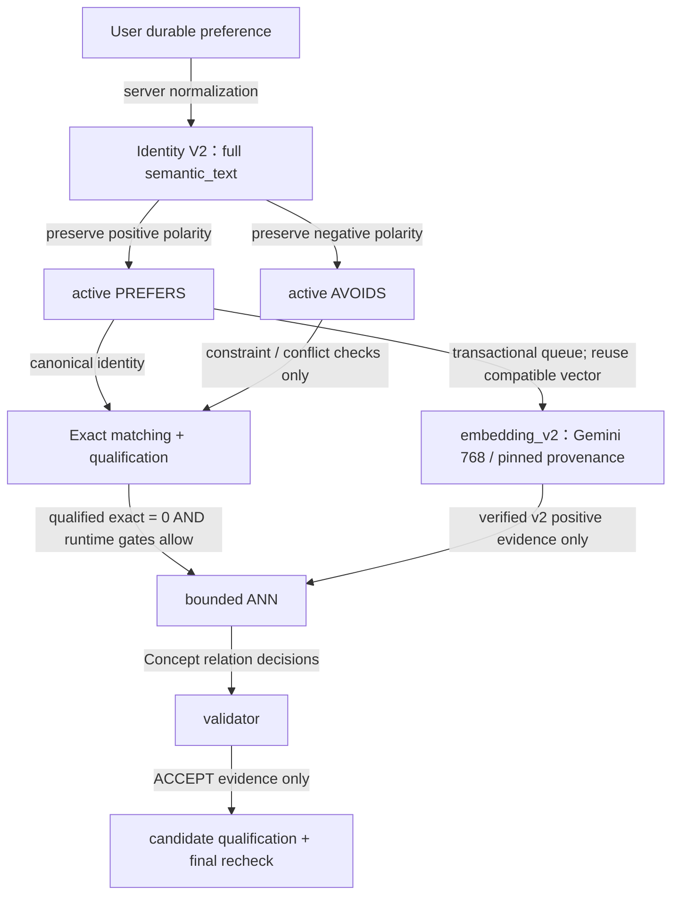
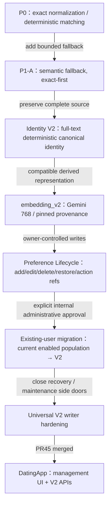

# Preference Lifecycle / Matching：目前架構與演進

## TL;DR

**Identity V2 是目前與未來 enabled users 的 durable preference 標準；V1/legacy 只保留歷史／必要唯讀 compatibility，不再是 writer target。** Preference identity、向量 readiness、semantic activation 是三件不同的事。Exact 不等待 embedding；related-interest 也不代表雙方有相同或共同偏好。

本頁涵蓋 preference matching/lifecycle，不涵蓋一般 Ayue memories、聊天摘要、profile facts、Event pipeline 或 P1-B。以下「V1/V2」是 **preference identity**，不是 Public/Private Ayue runtime 或 relation-policy schema 版本。

來源基線：backend `709ffc9da2c6649ae55f27a182a9703d92694245`（[PR #29](https://github.com/sunnysideup116116-bit/backend/pull/29)）；DatingApp main merge `66ba6e8ecd3f2adbcaf95859073eac906e78dc8c`（[PR #45](https://github.com/edwinchu0711/DatingApp/pull/45)）。2026-09-28 canonical runtime restoration 重新核對 production。文件只整理既有事實，不授權 migration、flag activation 或 APK packaging。

## Relevant Source Files / 責任邊界

| Boundary | 責任 | Source |
| --- | --- | --- |
| DatingApp | owner JWT、完整 source、opaque action ref、stale 後 refetch；不生成 canonical key | PR #45 `lib/services/ayue_v3_api_service.dart:L1252-L1523`、`lib/pages/preference_lifecycle_page.dart:L69-L349` |
| Social | owner-authenticated lifecycle API、Mongo projection／reconciliation | [bootstrap service](../social/services/preference_bootstrap_service.py#L70-L300)、[memory service](../social/services/memory_service.py#L311-L359) |
| Matchmaker / Neo4j | server-owned identity、owner fence、active PREFERS/AVOIDS 真相、retrieval／recheck | [identity](../matchmaker_agent/concept_identity.py#L156-L283)、[restore](../matchmaker_agent/preference_restore.py#L23-L112) |
| Derived embedding worker | Graph transaction 內 enqueue；transaction 外 Gemini；finish 重新驗證 source/lease | [queue](../matchmaker_agent/preference_embedding_jobs.py#L17-L131)、[worker](../social/services/preference_embedding_service.py#L28-L71) |
| Matching | qualified exact 優先，semantic evidence 與 proposal 前重新資格確認 | [retrieval](../matchmaker_agent/related_interest_retrieval.py#L82-L182)、[proposal eligibility](../social/services/semantic_proposal_eligibility.py#L12-L58) |

Neo4j 是 active preference association authority；Mongo profile preview/facts 不得被當成完整 Graph source 重建身份。Appwrite 提供 enabled account／canonical owner identity；三個 store 不是 distributed ACID。[Schema](NEO4J_SCHEMA.md)、[readiness / eligibility](SEMANTIC_INTERNAL_ROLLOUT.md) 記錄各自邊界。

## Architecture diagram：preference 到 matching

AVOIDS 只作負向限制，不是 positive semantic evidence；AVOIDS-only owner 不會因此成為 positive candidate。Embedding pending 時，active v2 preference 仍可 exact match。Semantic 固定為 **exact → qualified exact = 0 → bounded ANN → validator → final recheck**；qualified exact > 0 不觸發 ANN/validator，也不以 semantic 補滿 exact 結果。Runtime global flags、kill、enabled owner、history/block/quota/consent 等仍須全部通過。[Lifecycle](PREFERENCE_LIFECYCLE_V2.md#incremental-embedding-lifecycle)、[rollout](SEMANTIC_INTERNAL_ROLLOUT.md#candidate-proof-and-final-proposal-boundary)。

## Key Concepts

| Concept | 目前定位 | Source |
| --- | --- | --- |
| V1 / legacy | historical identity／association；唯讀 compatibility 必須有可信 owner evidence，不能猜 suffix 或重建舊 identity | [identity read policy](PREFERENCE_IDENTITY_V2.md#exact-read-and-legacy-policy) |
| Identity V2 | 完整 normalized `semantic_text` 決定 deterministic canonical identity；`display_label` 只供顯示 | `matchmaker_agent/concept_identity.py:L156-L235` |
| PREFERS / AVOIDS | owner association 的正／負 polarity；不能由 ANN score、validator rejection 或一般聊天摘要推導 | [writer inventory](UNIVERSAL_V2_WRITER_HARDENING.md#reachable-writer-inventory) |
| embedding_v2 | compatible source hash、runtime/provenance fingerprint、768 finite/nonzero/L2-normalized vector；只用 dedicated index | `matchmaker_agent/preference_embedding_contract.py:L9-L25`、`matchmaker_agent/semantic_evidence_readiness.py:L10-L30` |
| Related-interest | 支持探索相關興趣，不保證 identical/shared preference，也不把 query 當 requester 的 durable assertion | [candidate/recheck contract](SEMANTIC_INTERNAL_ROLLOUT.md#candidate-proof-and-final-proposal-boundary) |

`Concept.embedding`／舊 vector index 不得作新 preference semantic runtime fallback。舊向量不因此刪除、重建或覆寫；Event 等非 preference domain 的既有用途不在本次變更範圍。[Identity contract](PREFERENCE_IDENTITY_V2.md)、[lifecycle queue](PREFERENCE_LIFECYCLE_V2.md#incremental-embedding-lifecycle)。

## How it works：所有 future writers 的一致邊界

新帳號第一筆、EMPTY owner 下一筆、registration/onboarding、chat-derived durable preference、profile add、voice add 都走既有 server Identity-v2 writer；Client 不理解或生成 key／OpenCC／Concept reuse／provenance。[Registration](REGISTRATION_GRAPH_BOOTSTRAP.md)、`matchmaker_agent/registration_graph.py:L72-L149`。

Correct/edit 改 owner association，不原地改 shared Concept identity；disable 只退休該 owner 的 association。成功後 action ref 失效，stale 回409並重新 fetch。Legacy restore 只能經 deterministic canonicalization create/reuse v2，保留 owner/polarity，legacy 保持 inactive；不能轉換就拒絕。Manual projection rebuild 只能投影**已存在、authoritative active v2**，不是 migration authority，不能從舊 payload 造新 key。會恢復 legacy 的 bootstrap rollback 與歷史 CLI apply 均 fail closed；純 v2 rollback 保留。[Action/lifecycle](PREFERENCE_LIFECYCLE_V2.md#new-writes-and-immutable-identity)、`scripts/rebuild_neo4j_projection.py:L57-L133`、`scripts/migrate_neo4j_preferences.py:L57-L64`。

Concept-level validator ERROR 永不形成 evidence；6 REJECT + 2 ERROR 可正常 no-match，ACCEPT + ERROR 只使用可信 ACCEPT。Zero trusted decisions／systemic unavailable 仍回 typed unavailable；3-in-15-minute continuous protection、kill 與 proposal final recheck 不變。[Retrieval](../matchmaker_agent/related_interest_retrieval.py#L162-L182)。

## 演進：這一階段完成了什麼

下圖是能力演進，不是重新評分 frozen R3 實驗。R3.3/R3.4 的既有 FAIL 與其他歷史研究數字保持原樣；後續 related-interest product policy／production canary 的批准是另一份證據。

既有 internal test population 的一次性 administrative migration 已獨立批准並完成：只取 authoritative active PREFERS/AVOIDS，保留 polarity與0 AVOIDS；接受既有 canonicalizer 的 deterministic normalization，不拆分／猜測／人工改寫，不把一般 memory/profile facts 轉 preference。原5個v2 owners加24個 migrated owners；identity repair後另外10個 EMPTY，不需 migration。這不是未來 silent migration 授權；外部或需 owner confirmation 的使用者仍走完整 source → review/edit → explicit consent → fresh receipt → complete-set transaction。[Lifecycle](PREFERENCE_LIFECYCLE_V2.md)、[bootstrap](PREFERENCE_BOOTSTRAP_RUNTIME.md)。

## Production snapshot — 2026-09-28

下列為已接受且於 canonical restoration 重新驗證的 bounded read-only audit；不是永久固定 population/corpus，也不是全歷史內容稽核。Private owner IDs、原文與 credentials 不寫入文件。

| 指標 | 已驗證值 | Evidence |
| --- | --- | --- |
| Enabled / eligible | 39 / 39 | 2026-09-28 operator audit |
| READY v2 owners / EMPTY | 29 / 10 | 同次 lifecycle inventory |
| Blocked identity | 0 | Graph/Mongo identity gate |
| Enabled owners active legacy edges | 0 | owner-scoped active Graph audit |
| Active PREFERS compatible embedding | 64 / 64 | source/hash/runtime/provenance gate |
| Non-enabled historical legacy edges | 2，explicit out-of-scope，未修改 | 同次全庫 metadata 對照；**不得寫成全 Graph=0** |
| Health / Graph-Mongo integrity / index | 4/4 HTTP200 / PASS / ONLINE | canonical `start_all.sh` restoration |
| Backend running commit | `709ffc9da2c6649ae55f27a182a9703d92694245` | running process provenance + file hashes |
| DatingApp main merge | `66ba6e8ecd3f2adbcaf95859073eac906e78dc8c` | PR #45 merge + ancestor/tree verification |

此 snapshot 的 **semantic／related-interest／bootstrap OFF，new embedding_v2 worker ON，historical worker OFF，kill engaged**；routing 為 `enabled_accounts`，但 routing/readiness 不等於 activation。本輪沒有做新的 migration、P1-B 或 APK packaging，亦未改 build/signing workflow。主 `Server` dirty worktree 的 tracked/non-ignored source、index/status hashes 在 runtime restoration 前後一致；production code authority 是獨立 clean release。

## Getting started / Cross-references

先讀本頁，再依問題進入 [Identity V2](PREFERENCE_IDENTITY_V2.md)、[Lifecycle API](PREFERENCE_LIFECYCLE_V2.md)、[eligibility/matching](SEMANTIC_INTERNAL_ROLLOUT.md) 或 [writer hardening](UNIVERSAL_V2_WRITER_HARDENING.md)。DatingApp 的對應說明在其 repo `docs/PREFERENCE_LIFECYCLE_V2.md`。需要新 inventory 時使用受控唯讀 `scripts/report_semantic_rollout.py --lifecycle`；文件不授權對 production 執行任何 apply。

## Active Development Areas / 未完成事項

[NEEDS INVESTIGATION] 後續 semantic activation、外部使用者 rollout 與 external APK build/packaging 結果需各自取得最新操作批准及驗證；不能由資料 ready 或 PR merge 推論完成。P1-B 未開始。自動分析器此次缺 AST/PageRank 等 optional capabilities，文件採狹義 source review、Git/GitNexus定位及已驗證 operator receipts，不聲稱完整 repository reverse engineering。
