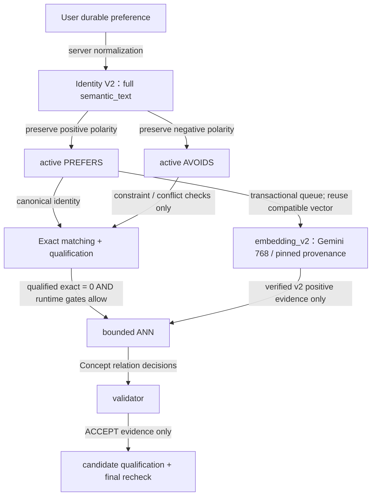
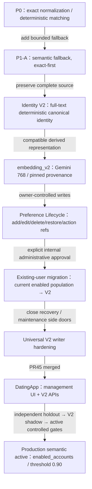

# Preference Lifecycle / Matching：目前架構與演進

## TL;DR

**Identity V2 是目前與未來 enabled users 的 durable preference 標準；V1/legacy 只保留歷史／必要唯讀 compatibility，不再是 writer target。** Preference identity、向量 readiness、semantic activation 是三件不同的事。Exact 不等待 embedding；related-interest 也不代表雙方有相同或共同偏好。

本頁涵蓋 preference matching/lifecycle，不涵蓋一般 Ayue memories、聊天摘要、profile facts、Event pipeline 或 P1-B。以下「V1/V2」是 **preference identity**，不是 Public/Private Ayue runtime 或 relation-policy schema 版本。

**Closeout — 2026-09-29：`PREFERENCE_AND_SEMANTIC_ROLLOUT_COMPLETE = YES`。** Preference V2 rollout 與 Semantic related-interest production activation 均已接受完成；production 現為 `enabled_accounts` / semantic active，而非 implemented-but-OFF。

Production code authority：backend `8ccfe09f688b92c105e961994e4d1da87ed480b7`（[PR #31](https://github.com/sunnysideup116116-bit/backend/pull/31)），保留 [PR #29](https://github.com/sunnysideup116116-bit/backend/pull/29) 的 Universal V2 writer hardening；DatingApp integration merge `66ba6e8ecd3f2adbcaf95859073eac906e78dc8c`（[PR #45](https://github.com/edwinchu0711/DatingApp/pull/45)）。本文件記錄已批准、已驗證的狀態；docs-only closeout 不執行部署、改 flags、migration 或 APK packaging。

## Relevant Source Files / 責任邊界

| Boundary | 責任 | Source |
| --- | --- | --- |
| DatingApp | owner JWT、完整 source、opaque action ref、stale 後 refetch；不生成 canonical key | PR #45 `lib/services/ayue_v3_api_service.dart:L1252-L1523`、`lib/pages/preference_lifecycle_page.dart:L69-L349` |
| Social | owner-authenticated lifecycle API、Mongo projection／reconciliation | [bootstrap service](../social/services/preference_bootstrap_service.py#L70-L300)、[memory service](../social/services/memory_service.py#L311-L359) |
| Matchmaker / Neo4j | server-owned identity、owner fence、active PREFERS/AVOIDS 真相、retrieval／recheck | [identity](../matchmaker_agent/concept_identity.py#L156-L283)、[restore](../matchmaker_agent/preference_restore.py#L23-L112) |
| Derived embedding worker | Graph transaction 內 enqueue；transaction 外 Gemini；finish 重新驗證 source/lease | [queue](../matchmaker_agent/preference_embedding_jobs.py#L17-L131)、[worker](../social/services/preference_embedding_service.py#L28-L71) |
| Matching | qualified exact 優先，semantic evidence 與 proposal 前重新資格確認 | [retrieval](../matchmaker_agent/related_interest_retrieval.py#L82-L182)、[proposal eligibility](../social/services/semantic_proposal_eligibility.py#L12-L58) |

Neo4j 是 active preference association authority；Mongo profile preview/facts 不得被當成完整 Graph source 重建身份。Appwrite 提供 enabled account／canonical owner identity；三個 store 不是 distributed ACID。[Schema](NEO4J_SCHEMA.md)、[readiness / eligibility](SEMANTIC_INTERNAL_ROLLOUT.md) 記錄各自邊界。

## Architecture diagram：preference 到 matching



AVOIDS 只作負向限制，不是 positive semantic evidence；AVOIDS-only owner 不會因此成為 positive candidate。Embedding pending 時，active v2 preference 仍可 exact match。Semantic 固定為 **exact → qualified exact = 0 → bounded ANN → validator → final recheck**；qualified exact > 0 不觸發 ANN/validator，也不以 semantic 補滿 exact 結果。Runtime global flags、kill、enabled owner、history/block/quota/consent 等仍須全部通過。[Lifecycle](PREFERENCE_LIFECYCLE_V2.md#incremental-embedding-lifecycle)、[rollout](SEMANTIC_INTERNAL_ROLLOUT.md#candidate-proof-and-final-proposal-boundary)。

## Key Concepts

| Concept | 目前定位 | Source |
| --- | --- | --- |
| V1 / legacy | historical identity／association；唯讀 compatibility 必須有可信 owner evidence，不能猜 suffix 或重建舊 identity | [identity read policy](PREFERENCE_IDENTITY_V2.md#exact-read-and-legacy-policy) |
| Identity V2 | 完整 normalized `semantic_text` 決定 deterministic canonical identity；`display_label` 只供顯示 | `matchmaker_agent/concept_identity.py:L156-L235` |
| PREFERS / AVOIDS | owner association 的正／負 polarity；不能由 ANN score、validator rejection 或一般聊天摘要推導 | [writer inventory](UNIVERSAL_V2_WRITER_HARDENING.md#reachable-writer-inventory) |
| embedding_v2 | compatible source hash、runtime/provenance fingerprint、768 finite/nonzero/L2-normalized vector；只用 dedicated index | `matchmaker_agent/preference_embedding_contract.py:L9-L25`、`matchmaker_agent/semantic_evidence_readiness.py:L10-L30` |
| Related-interest | 支持探索相關興趣，不保證 identical/shared preference，也不把 query 當 requester 的 durable assertion | [candidate/recheck contract](SEMANTIC_INTERNAL_ROLLOUT.md#candidate-proof-and-final-proposal-boundary) |

`Concept.embedding`／舊 vector index 不得作新 preference semantic runtime fallback。舊向量不因此刪除、重建或覆寫；Event 等非 preference domain 的既有用途不在本次變更範圍。[Identity contract](PREFERENCE_IDENTITY_V2.md)、[lifecycle queue](PREFERENCE_LIFECYCLE_V2.md#incremental-embedding-lifecycle)。

## How it works：所有 future writers 的一致邊界

新帳號第一筆、EMPTY owner 下一筆、registration/onboarding、chat-derived durable preference、profile add、voice add 都走既有 server Identity-v2 writer；Client 不理解或生成 key／OpenCC／Concept reuse／provenance。[Registration](REGISTRATION_GRAPH_BOOTSTRAP.md)、`matchmaker_agent/registration_graph.py:L72-L149`。

Correct/edit 改 owner association，不原地改 shared Concept identity；disable 只退休該 owner 的 association。成功後 action ref 失效，stale 回409並重新 fetch。Legacy restore 只能經 deterministic canonicalization create/reuse v2，保留 owner/polarity，legacy 保持 inactive；不能轉換就拒絕。Manual projection rebuild 只能投影**已存在、authoritative active v2**，不是 migration authority，不能從舊 payload 造新 key。會恢復 legacy 的 bootstrap rollback 與歷史 CLI apply 均 fail closed；純 v2 rollback 保留。[Action/lifecycle](PREFERENCE_LIFECYCLE_V2.md#new-writes-and-immutable-identity)、`scripts/rebuild_neo4j_projection.py:L57-L133`、`scripts/migrate_neo4j_preferences.py:L57-L64`。

Concept-level validator ERROR 永不形成 evidence；6 REJECT + 2 ERROR 可正常 no-match，ACCEPT + ERROR 只使用可信 ACCEPT。Zero trusted decisions／systemic unavailable 仍回 typed unavailable；3-in-15-minute continuous protection、kill 與 proposal final recheck 不變。[Retrieval](../matchmaker_agent/related_interest_retrieval.py#L162-L182)。

## Production semantic contract

- **Exact-first：qualified exact > 0 → exact only；ANN calls = 0、validator calls = 0。** 只有 qualified exact = 0 才可進 semantic fallback；不能用 semantic 補滿已有 qualified exact 的結果。
- ANN 僅使用 `concept_embedding_v2_index` / compatible `embedding_v2`。`MATCH_PREFERENCE_SEMANTIC_MIN_SIMILARITY=0.90` 比較的是 Neo4j 回傳的 **`score = (1 + raw cosine) / 2`**，等價 raw cosine 0.80，不是 raw cosine 0.90。Threshold 在 ANN retrieval gate 比較；不取代 validator taxonomy。這是已核准的 production runtime 設定，不是本文件修改 source default。
- Validator model 為 **`deepseek-v4.1-flash:cloud`**，透過正式 adapter/auth/parser path；不以 catalog 名稱靜默替換 alias。Gemini 768-dim query/Concept embedding pipeline、source hash 與 pinned runtime/provenance checks 不變。
- ACCEPT 才能進 active PREFERS owner expansion；candidate 必須 enabled、identity/profile 唯一、V2/source/vector 合格，並通過 block/history/quota/qualification。Proposal 前仍重新驗證 owner、polarity、relation、source/fingerprint/readiness 與 consent/lifecycle，任何不符均 drop。
- **ERROR 不是 ACCEPT，也沒有猜測的 relation。** 有可信 decisions 時只用其 ACCEPT；可信 decisions 全為 REJECT 且伴隨 partial ERROR，可正常 no-match。零可信 decisions（有待驗證 Concepts）、provider/systemic failure 或無法在 shared deadline 內形成可信結果，仍為 typed unavailable；ANN 無 hit 則正常 no-match，不是 validator outage。Partial ERROR 本身不是整筆 job unavailable 或自動 kill 的理由。
- User-visible reason/opening 只能表達「相關／相近興趣」，**不得把 related-interest 描述成 shared / same / identical preference 或共同偏好**。Query intent 不是 requester 的 durable preference；宣稱本人已保存 Q 仍需 fresh positive Q proof。Draft 不會自動送 invitation，原 confirmation/mutual-consent contract 保留。
- Matching 不寫 PREFERS/AVOIDS，不把 rejection 寫成 AVOIDS；AVOIDS 永非 positive evidence。Embedding pending 不阻擋 exact matching；historical embedding/index 不作 semantic fallback，也不覆寫歷史向量。

已批准的 synthetic holdout、V2 shadow no-visible-effect proof 與 regression 保留於 [historical shadow rollout evidence](V2_SEMANTIC_SHADOW.md)，不是當前 activation runbook，也不是自然流量可靠性保證。

## 演進：這一階段完成了什麼

下圖是能力演進，不是重新評分 frozen R3 實驗。R3.3/R3.4 的既有 FAIL 與其他歷史研究數字保持原樣；後續 related-interest product policy／production canary 的批准是另一份證據。



既有 internal test population 的一次性 administrative migration 已獨立批准並完成：只取 authoritative active PREFERS/AVOIDS，保留 polarity與0 AVOIDS；接受既有 canonicalizer 的 deterministic normalization，不拆分／猜測／人工改寫，不把一般 memory/profile facts 轉 preference。原5個v2 owners加24個 migrated owners；identity repair後另外10個 EMPTY，不需 migration。這不是未來 silent migration 授權；外部或需 owner confirmation 的使用者仍走完整 source → review/edit → explicit consent → fresh receipt → complete-set transaction。[Lifecycle](PREFERENCE_LIFECYCLE_V2.md)、[bootstrap](PREFERENCE_BOOTSTRAP_RUNTIME.md)。

## Production snapshot — 2026-09-29

下列為已接受的 active controlled gate 與後續唯讀複核（Asia/Taipei 12:21、13:29）；不是永久固定 population/corpus，也不是全歷史內容稽核。Private owner IDs、原文與 credentials 不寫入文件。2026-09-28 的 `709ffc9...` / semantic OFF snapshot 是前一階段歷史狀態，已由本節取代。

| 指標 | 已驗證值 | Evidence |
| --- | --- | --- |
| Enabled / eligible | 39 / 39 | 2026-09-29 operator audit |
| READY v2 owners / EMPTY | 29 / 10 | 同次 lifecycle inventory |
| Blocked identity | 0 | Graph/Mongo identity gate |
| Enabled owners active legacy edges | 0 | owner-scoped active Graph audit |
| Active PREFERS compatible embedding | 64 / 64 | source/hash/runtime/provenance gate |
| Semantic-ready candidate owners | 28 | active verified positive evidence；與 requester eligibility 分開 |
| Verified V2 Concepts / compatible embedding_v2 | 70 / 68 | 非所有 Concept 都需要 positive vector |
| Incremental queue | 43 complete，無 pending/stuck | scoped fixture cleanup 後 inventory |
| Non-enabled historical legacy edges | 2，explicit out-of-scope，未修改 | 同次全庫 metadata 對照；**不得寫成全 Graph=0** |
| Health / Graph-Mongo integrity / index | 4/4 HTTP200 / PASS / ONLINE | canonical `start_all.sh` release + active gate |
| Backend running commit | `8ccfe09f688b92c105e961994e4d1da87ed480b7` | running process provenance + file hashes |
| DatingApp main merge | `66ba6e8ecd3f2adbcaf95859073eac906e78dc8c` | PR #45 merge + ancestor/tree verification |

### Current production flags

```ini
MATCH_PREFERENCE_SEMANTIC_MODE=active
MATCH_RELATED_INTEREST_ENABLED=on
MATCH_RELATED_INTEREST_ROLLOUT_MODE=enabled_accounts
MATCH_PREFERENCE_SEMANTIC_MIN_SIMILARITY=0.90
MATCH_PREFERENCE_SEMANTIC_EMBEDDING_SPACE_CONFIRMED=on
PREFERENCE_BOOTSTRAP_ENABLED=off
PREFERENCE_EMBEDDING_V2_ENABLED=on
CONCEPT_EMBEDDING_WORKER_ENABLED=off
```

Shared kill file：**absent / cleared**。實際位置以四服務一致的 `MATCH_RELATED_INTEREST_KILL_SWITCH_FILE` 為準；不能用呼叫者 cwd 推定另一個 kill file。`enabled_accounts` 不再依賴固定五人 allowlist；EMPTY owner 可作 requester，但不會被虛構為 positive candidate。Bootstrap 仍 OFF，activation 不是新的 migration 授權。

### Accepted controlled activation evidence

| Control | 已驗證結果 | Latency |
| --- | --- | --- |
| Exact active no-commit | qualified exact 1；ANN / validator 0；selection 1；既有 fence 在 proposal commit 前停止 | 4.37s pipeline，非完整 proposal E2E |
| Related active E2E | exact 0；score 0.9774；candidate_more_specific ACCEPT；qualification / final proof PASS；真實 disposable draft 1，invitation 0 | 28.13s job creation→completion |
| Unrelated active | exact 0；retained ANN hit 0；validator 0；正常 no-match，proposal 0 | 4.27s job creation→completion |

Related job 當次為 **1 ACCEPT / 1 REJECT（candidate_more_broad）/ 6 ERROR**，4 attempts、2 retries；draft 只使用當次 fresh ACCEPT evidence，未重用先前 shadow 的 2 ACCEPT / 6 ERROR 判定。Typed unavailable 0、breaker 未觸發。App card 表達「這是相關而非已確認相同的偏好」，不宣稱共同偏好。

Scoped cleanup 移除 draft、2 inbox references、2 disposable owners 與2個新增 test Concepts/vectors；必要 terminal jobs/accounting 留作 audit。原 preference hashes／vectors 恢復一致，原28個 compatible vectors 與 historical properties 未覆寫；真人 message/thread/read state、dirty `Server` source/index/status hashes 未變。窗口內非測試 jobs 為0，**不可據此宣稱自然流量 reliability PASS**；partial ERROR 的限制如實保留。Private receipts 不進 Git。

## Kill / rollback runbook

這是已接受的緊急停止 policy，不是本 docs-only PR 執行 runtime 操作的授權。

1. 若發現 account leakage、ERROR／拒絕／constraint relation 進 positive evidence、false shared-preference claim、V2/source/fingerprint 證據失效、identity/data corruption、kill 失效或其他 active safety anomaly，立即 engage **同一個已核對的 shared kill file**，停止新 semantic work；kill 同時阻擋 active 與 shadow，不得繞過。
2. 將 `MATCH_PREFERENCE_SEMANTIC_MODE=off`、`MATCH_RELATED_INTEREST_ENABLED=off`、`MATCH_PREFERENCE_SEMANTIC_EMBEDDING_SPACE_CONFIRMED=off`，維持 kill engaged。透過目前 reviewed clean release 的 canonical `start_all.sh` procedure 套用並核對所有四服務；不得從 dirty `Server` 重建 baseline，不 stash/reset/clean 該 worktree。
3. 除非另有明確事故處置批准，bootstrap 保持 OFF、new V2 worker ON、historical worker OFF；不回滾／修補真人 preference，不改 threshold/model/taxonomy，不刪歷史 vectors 或真實 proposal/message。Exact 與既有非 semantic lifecycle 保持原 contract。
4. 核對 running commit/provenance、四項 health200、OFF flags/shared kill、Graph/Mongo integrity、index/source/vector/queue；保存必要 aggregate 與精確 test-artifact receipts，STOP 並回報原因。安全條件無法驗證時保持 fail closed，不自動 clear kill 或重啟 semantic；恢復需要新的批准。

Server continuous protection 保持 **15分鐘內連續3筆 typed unavailable**（`semantic_validator_unavailable`／`semantic_retrieval_timeout`）即 engage 同一 kill；active 與 historical shadow stream 各自依既有 policy 計數。可信 ACCEPT／REJECT 伴隨 Concept ERROR 不等於 typed unavailable，不能因 partial ERROR 自行放寬 validator，也不能把它當作 false healthy zero。Timeout/cancellation/shared deadline 不變：每 attempt最多6s、validator shared最多18s、semantic envelope最多38s；proposal final recheck 在原 selection deadline內最多5s。

舊 five-user／28-vector frozen 15分鐘外部 monitor 不恢復；使用既有 population-independent telemetry／受控唯讀 reporter。任何新 recurring schedule 需另行批准。Provider/catalog readiness 與可 inference 的 adapter contract須分開；不使用 TLS bypass。Shadow 文件與舊 canary / NO-GO 紀錄僅供歷史證據，不能用來覆蓋本節的 current policy。

## Getting started / Cross-references

先讀本頁，再依問題進入 [Identity V2](PREFERENCE_IDENTITY_V2.md)、[Lifecycle API](PREFERENCE_LIFECYCLE_V2.md)、[eligibility/matching](SEMANTIC_INTERNAL_ROLLOUT.md) 或 [writer hardening](UNIVERSAL_V2_WRITER_HARDENING.md)。DatingApp 的對應說明在其 repo `docs/PREFERENCE_LIFECYCLE_V2.md`。需要新 inventory 時使用受控唯讀 `scripts/report_semantic_rollout.py --lifecycle`；文件不授權對 production 執行任何 apply。

## Active Development Areas / 未完成事項

Preference V2 與 semantic production activation 已 closeout；外部使用者 onboarding／需本人確認的 migration 與 external APK build/packaging 不因此被宣告完成或授權。P1-B 未開始。Controlled smoke 不取代持續 availability／latency 的有分母觀察；文件依 source review、Git/GitNexus定位及已接受的 bounded operator receipts，不聲稱完整 repository reverse engineering或全歷史內容稽核。
